# System Architecture Document

## AI Powered Enterprise Citizen Service & Grievance Management Platform

| | |
|---|---|
| **Document Status** | DRAFT — Pending Client Approval |
| **Version** | 1.0 |
| **Date** | 2026-07-19 |
| **Based On** | `docs/SRS.md` v0.2 (Approved); System Architecture v0.1 (client-reviewed, enhanced per Principal Enterprise Solution Architect review) |
| **Pilot Deployment** | Tambaram City Municipal Corporation, Tamil Nadu, India |

> Scope of this document: Sections 1–21 as requested. **Database design is explicitly excluded** and will be a separate deliverable. No code is included — this is design only.

**Changelog — v0.1 → v1.0**: Added Sections 12–21 following an enterprise architecture review: High Availability, Scalability (5K/50K/5-lakh-per-day tiers), Disaster Recovery, Observability, Redis Architecture, Scheduler Architecture, Agent Communication Architecture, File Storage Architecture, Future Integrations Architecture, and Architecture Decision Records. Sections 1–11 are unchanged from v0.1 (no redesign, per instruction) — only re-numbered where the former closing sections (Out of Scope, Approval) shifted down to accommodate the new material.

---

## 0. Architectural Principles

Every decision below is a direct consequence of the approved SRS and is re-stated here so the architecture is traceable to a requirement, not invented:

1. **Config-driven, not code-driven** (SRS §7) — departments, hierarchy, SLA, escalation, categories, notification templates, and provider selection are tenant data, never hardcoded branches in service logic.
2. **Multi-tenant from day one** (SRS §1.3) — every request is resolved within a `tenant` context; Tambaram is tenant #1, not a special case in code.
3. **Provider abstraction** (SRS §2.5, §10) — AI, Voice, WhatsApp, SMS providers sit behind interfaces so Claude, Whisper, or any channel provider can be swapped without touching business logic.
4. **PII never leaves government infrastructure unmasked** (SRS §10) — enforced as a mandatory pipeline stage, not an optional check.
5. **Async by default for anything slow or external** — AI inference, voice transcription, and outbound notifications never block the citizen-facing request/response cycle (this is how 99.9% availability and 5000 complaints/day peak are achievable on a 2-VM Phase-1 footprint).
6. **Cloud-ready without redesign** (SRS §2.2.6, §11.2) — Phase-1 runs as PM2-managed Node processes on 2 VMs, but every service is built as an independently deployable unit so it can become a container/pod later with no logic change.

---

## 1. Overall Architecture

The platform is a **service-oriented, event/queue-augmented architecture** — logically decomposed into independent services (Section 3), physically consolidated onto Phase-1's 2-VM footprint (Section 5), and designed so that consolidation is purely a deployment decision, reversible at any time.

Three interaction patterns are used throughout, chosen per interaction:

| Pattern | Used For | Why |
|---|---|---|
| **Synchronous REST** (internal, over private network) | Gateway → core services; anything the user is actively waiting on (login, fetch complaint, view dashboard) | Low latency, simple request/response |
| **Asynchronous queue** (Redis-backed, BullMQ-style) | AI classification, voice transcription, notification delivery, SLA/escalation checks | Decouples slow/external-dependent work from the citizen-facing request path; provides retry, backoff, and dead-letter handling |
| **Scheduled jobs** (node-cron) | SLA breach scanning, reminders, auto-escalation, report generation | Time-driven, not request-driven, work |

The citizen never waits on Claude, Whisper, or an external notification provider to get an acknowledgment. A complaint is **registered and tracking-ID-issued synchronously**; classification, assignment, and notification happen **asynchronously within seconds**, with the Timeline (SRS §3.2) reflecting each stage as it completes.

---

## 2. High-Level Architecture Diagram

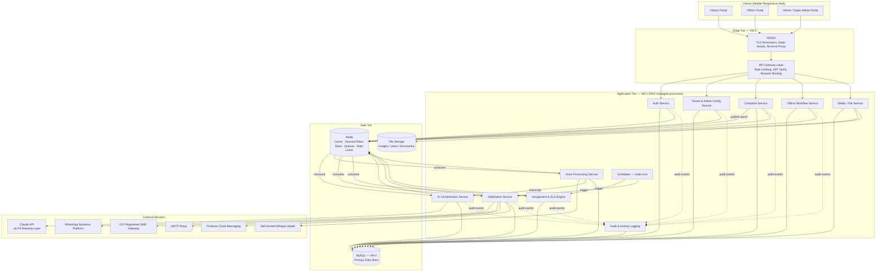

---

## 3. Microservices

### 3.1 Logical Service Catalogue

Each is an independently versioned codebase module with its own responsibility boundary — regardless of how many are physically co-located on VM-1 in Phase-1 (Section 3.2).

| # | Service | Responsibility | LLM-Backed? |
|---|---|---|---|
| 1 | **API Gateway** | TLS termination hand-off, routing, JWT verification, request-level rate limiting, request/response logging | No |
| 2 | **Auth Service** | Registration, Mobile OTP, password login, MFA, JWT + Refresh Token issuance/rotation, RBAC policy evaluation | No |
| 3 | **Tenant & Admin Config Service** | Departments, officer hierarchy, districts/zones/wards, complaint categories/status, SLA rules, escalation matrix, notification templates, provider configuration — all per-tenant | No |
| 4 | **Complaint Service** | Complaint CRUD, tracking ID generation (SRS §3.8), timeline, feedback, complaint history | No |
| 5 | **Officer Workflow Service** | Pending/assigned queues, status updates, document upload linkage, multi-level approvals, escalation actions | No |
| 6 | **Media / File Service** | Upload validation pipeline (SRS §8.2), storage abstraction, signed URL issuance | No |
| 7 | **AI Orchestration Service** | Hosts Complaint Agent, Officer AI Agent, Analytics Agent; PII masking; Claude provider adapter | **Yes** |
| 8 | **Voice Processing Service** | Whisper speech-to-text, language detection, hand-off to AI Orchestration for analysis/summary | Uses ASR model, not Claude, directly |
| 9 | **Assignment & SLA Engine** | Officer assignment (workload-based), SLA timer computation, breach detection, auto-escalation trigger | No — deterministic rules engine |
| 10 | **Notification Service** | Template rendering, channel routing, provider adapters (WhatsApp/SMS/Email/Push), delivery retry/tracking | No |
| 11 | **Analytics & Reporting Service** | District/department/monthly aggregation, feeds Analytics Agent for AI-generated summaries/predictions | Partially (summaries only) |
| 12 | **Audit & Activity Logging Service** | Immutable audit trail, activity monitoring, compliance report feed | No |
| 13 | **Scheduler** | node-cron triggers for SLA scans, reminders, escalation sweeps, report generation | No |

> **Design note (not a deviation from SRS §3.5, but a clarification):** the SRS labels all seven items in the "AI Agent Layer" as *Agents*. Architecturally, only the **Complaint Agent**, **Officer AI Agent**, **Analytics Agent**, and the classification portion of the **Voice Agent** actually invoke Claude. **Assignment Agent**, **SLA Agent**, and **Notification Agent** are implemented as deterministic rule/queue-driven engines (Assignment & SLA Engine, Notification Service). This is intentional: SLA timers, escalation, and notification dispatch must be 100% predictable and auditable for a government system — they must never depend on non-deterministic LLM output. The SRS's agent *responsibilities* (§3.5) are fully preserved; this is purely an implementation clarification.

### 3.2 Phase-1 Physical Grouping (2-VM constraint)

Thirteen logical services do not mean thirteen physical processes on a 2-VM footprint. They are grouped into **5 PM2-managed process groups on VM-1**, each independently horizontally scalable via PM2 cluster mode, and each a 1:1 candidate for its own container in the future Kubernetes state (SRS §11.2) with no code change — only a deployment manifest change.

| PM2 Process Group | Logical Services Inside | Scaling Unit |
|---|---|---|
| **core-api** (cluster mode, N instances = CPU cores) | API Gateway, Auth, Tenant/Admin Config, Complaint, Officer Workflow, Media, Audit Logging | Request-volume driven |
| **ai-service** | AI Orchestration Service (Complaint/Officer-AI/Analytics Agents, PII Masking, Claude Adapter) | Claude-call-volume driven, isolated so Claude latency never affects core-api |
| **voice-service** | Voice Processing Service (Whisper) | CPU/inference-bound, isolated for its own resource ceiling |
| **notification-service** | Notification Service | External-provider-latency-bound, isolated with its own retry/backoff |
| **scheduler** | Scheduler + Assignment & SLA Engine | Single active instance (leader) to avoid duplicate job execution |

Redis and NGINX run on VM-1 alongside these. MySQL runs alone on VM-2 (SRS §11.1).

---

## 4. Component Diagram

### 4.1 core-api Internal Layering (applies to Auth, Config, Complaint, Officer Workflow, Media)

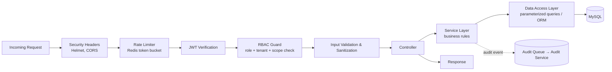

### 4.2 AI Orchestration Service — Internal Components

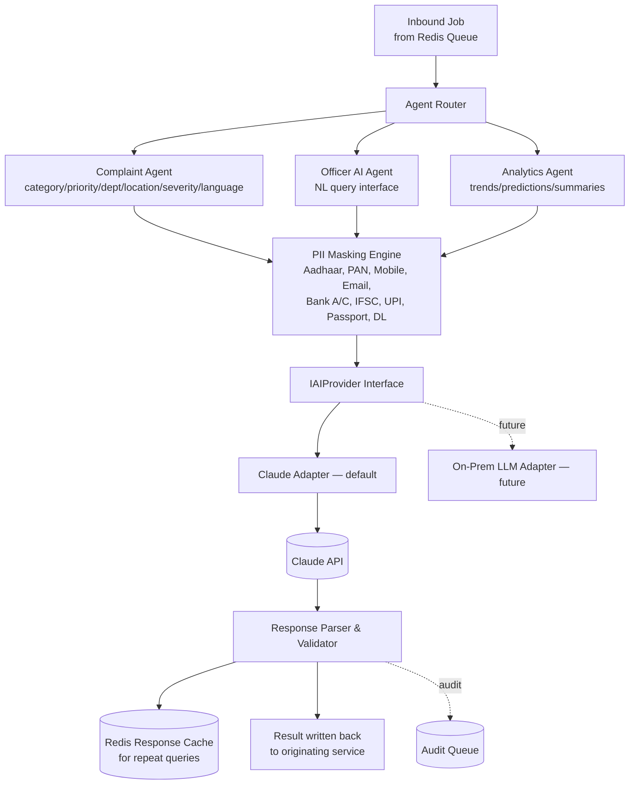

---

## 5. Deployment Diagram

```mermaid
flowchart TB
    subgraph Internet
        USERS[Citizens / Officers / Admins]
    end

    subgraph VM1["VM-1 — Application Server (Ubuntu)"]
        NGINX1[NGINX :443/:80<br/>TLS termination, static assets]
        subgraph PM2["PM2 Process Manager"]
            P1[core-api — cluster mode]
            P2[ai-service]
            P3[voice-service]
            P4[notification-service]
            P5[scheduler]
        end
        REDIS1[(Redis)]
        STORAGE1[(Local File Storage<br/>outside webroot)]
    end

    subgraph VM2["VM-2 — Database Server (Ubuntu)"]
        MYSQL1[(MySQL Primary)]
        BACKUP[Backup Agent<br/>daily full + binlog PITR]
    end

    subgraph SaaS["External SaaS (over TLS)"]
        CLAUDEX[Claude API]
        WAX[WhatsApp Business Platform]
        SMSX[DLT SMS Gateway]
        SMTPX[SMTP Relay]
        FCMX[Firebase Cloud Messaging]
    end

    USERS -->|HTTPS| NGINX1
    NGINX1 --> P1
    P1 <--> REDIS1
    P2 <--> REDIS1
    P3 <--> REDIS1
    P4 <--> REDIS1
    P5 <--> REDIS1
    P1 -->|3306, private network| MYSQL1
    P2 --> MYSQL1
    P3 --> MYSQL1
    P4 --> MYSQL1
    P1 --> STORAGE1
    P2 -->|HTTPS, masked payload only| CLAUDEX
    P3 -->|local inference, no external call| P3
    P4 --> WAX & SMSX & SMTPX & FCMX
    MYSQL1 --> BACKUP
    BACKUP -.offsite copy — Recommended Default, see SRS §11.4.-> OFFSITE[(Offsite/Object Storage<br/>for long-term archival)]
```

**Future state (no redesign required, SRS §11.2):** each PM2 process group above becomes its own container image; NGINX is replaced/fronted by a Load Balancer; VM-1/VM-2 become a Kubernetes node pool (on NIC MeghRaj or State Data Centre); MySQL can move to a managed/clustered instance; Redis can move to a managed cluster. Service code does not change — only environment configuration and the deployment manifest.

---

## 6. Communication Flow

### 6.1 End-to-End: Citizen Files a Text Complaint

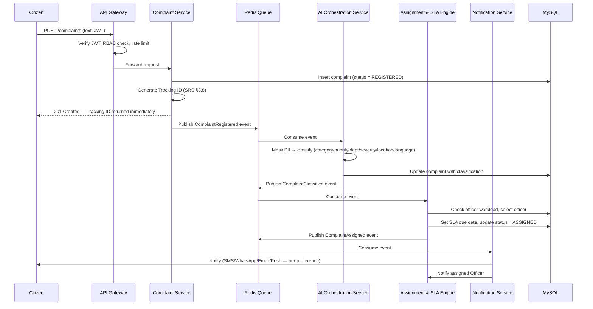

### 6.2 Internal Communication Summary

| From → To | Pattern | Notes |
|---|---|---|
| Client → Gateway | HTTPS/REST | Only externally exposed surface |
| Gateway → core-api services | Internal REST (private network / localhost) | Synchronous, low-latency |
| core-api → ai-service / voice-service / notification-service | Redis Queue (async) | Never blocks the citizen-facing request |
| scheduler → Assignment & SLA Engine / Notification Service | Redis Queue (cron-triggered) | Time-driven, not request-driven |
| Any service → Audit Service | Redis Queue (fire-and-forget event) | Audit writes never block business transactions |
| ai-service → Claude API | HTTPS, masked payload only | Only egress point for citizen-derived content leaving infra |

---

## 7. Authentication Flow

### 7.1 Citizen — Mobile OTP Registration/Login

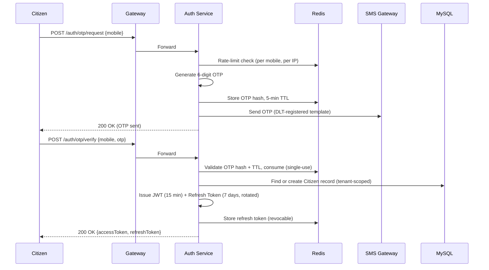

### 7.2 Officer / Corporation / Super Admin — Password + MFA (SRS §8.1)

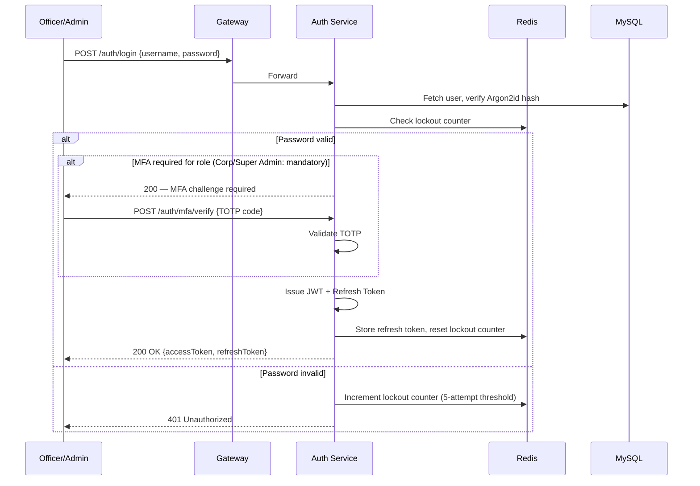

### 7.3 Token Refresh & Revocation

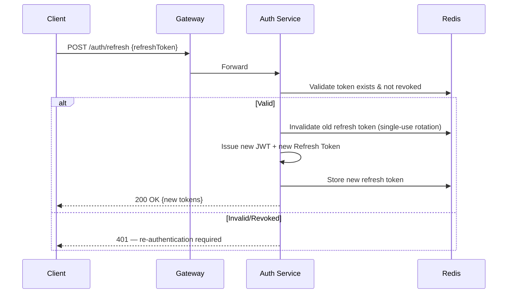

### 7.4 RBAC Enforcement (applies to every authenticated request)

Every request passes through the RBAC Guard (Section 4.1) which evaluates: **tenant match** → **role** → **permission for the requested action** → **scope** (e.g., an Officer may act only within their assigned department/ward; a Corporation Admin acts corporation-wide; a Department Admin is scoped to one department). Permission sets are tenant-configurable (SRS §7) and resolved from the Tenant & Admin Config Service, cached in Redis for low-latency checks on every request.

---

## 8. AI Architecture

### 8.1 Provider Abstraction

All AI calls go through an `IAIProvider` interface (Section 4.2 diagram). The Claude Adapter is the default, Phase-1 implementation. This satisfies SRS §2.5 and §10 — the on-premise LLM swap is a new adapter behind the same interface, with zero change to Complaint Agent, Officer AI Agent, or Analytics Agent logic.

### 8.2 PII Masking Pipeline (Mandatory, SRS §10)

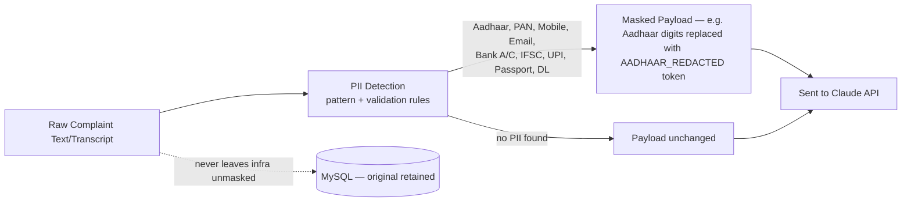

This stage is **not optional and not bypassable** by any agent — it is enforced at the `IAIProvider` boundary itself, so no future agent addition can accidentally skip it.

### 8.3 Resilience & Degradation

- **Claude API timeout/outage**: the complaint remains registered (Section 6.1's synchronous ack already happened); classification job is retried with exponential backoff via the queue's dead-letter/retry mechanism; if retries exhaust, the complaint is flagged for **manual officer categorization** rather than left unclassified indefinitely. AI is an accelerator, never a hard dependency for complaint registration.
- **Response caching**: Officer AI Agent and Analytics Agent responses to common/repeated queries are cached in Redis with a short TTL to reduce Claude API cost and latency.
- **Cost/usage governance**: every Claude call is logged (prompt token count, response token count, agent, tenant) to the Audit Service for cost attribution and anomaly detection.

### 8.4 Agent-to-Claude Responsibility Map

| Agent | Calls Claude? | Input | Output |
|---|---|---|---|
| Complaint Agent | Yes | Masked complaint text | Category, priority, department, location, severity, language |
| Officer AI Agent | Yes | Masked natural-language query + officer's scoped data summary | Natural-language answer / structured report |
| Analytics Agent | Yes (for summaries only) | Masked/aggregated statistics | Trend narrative, AI summary |
| Assignment Agent (Engine) | No | Officer workload data | Assignment decision (deterministic) |
| SLA Agent (Engine) | No | SLA config + complaint age | Breach flags, escalation triggers (deterministic) |
| Notification Agent (Service) | No | Event + template | Rendered message (deterministic) |

---

## 9. Voice Architecture

### 9.1 Design Decision: Self-Hosted Whisper

Whisper runs as a **self-hosted model within government infrastructure** (`voice-service` on VM-1), not a third-party hosted voice API. This is required by SRS §10's principle that citizen data must not leave government infrastructure unmasked — a voice recording can contain spoken Aadhaar numbers, addresses, and other PII, so it must never be sent to an external transcription API at all. Only the resulting **text transcript**, after PII masking, is eligible to reach Claude.

### 9.2 Voice Complaint Flow

```mermaid
sequenceDiagram
    participant Citizen
    participant Gateway
    participant Media as Media Service
    participant Queue as Redis Queue
    participant Voice as Voice Processing Service
    participant AI as AI Orchestration Service
    participant CmpSvc as Complaint Service

    Citizen->>Gateway: Upload audio (WAV/MP3/OGG, ≤10MB/5min)
    Gateway->>Media: Validate (format, size, malware scan — SRS §8.2)
    Media->>Media: Store audio file (5-year retention, SRS §4.3)
    Media-->>Citizen: 202 Accepted (processing)
    Media->>Queue: Publish VoiceUploaded event

    Queue->>Voice: Consume event
    Voice->>Voice: Whisper STT (self-hosted, Tamil/English)
    Voice->>Voice: Language detection confirmation
    Voice->>Queue: Publish TranscriptReady event

    Queue->>AI: Consume event
    AI->>AI: Mask PII → Complaint Agent analysis + summary
    AI->>Queue: Publish TranscriptAnalyzed event

    Queue->>CmpSvc: Consume event
    CmpSvc-->>Citizen: Show transcript + detected category for confirmation
    Note over Citizen,CmpSvc: Recommended Default — citizen taps "Confirm"<br/>before final registration (reduces misregistration risk;<br/>an addition to the base SRS §3.6 flow, not a contradiction of it)
    Citizen->>CmpSvc: Confirm
    CmpSvc->>CmpSvc: Register complaint (Tracking ID issued)
    CmpSvc->>Queue: Publish ComplaintRegistered event
    Note over Queue: Continues into Section 6.1 flow (Assignment, SLA, Notification)
```

---

## 10. Notification Architecture

### 10.1 Component Design

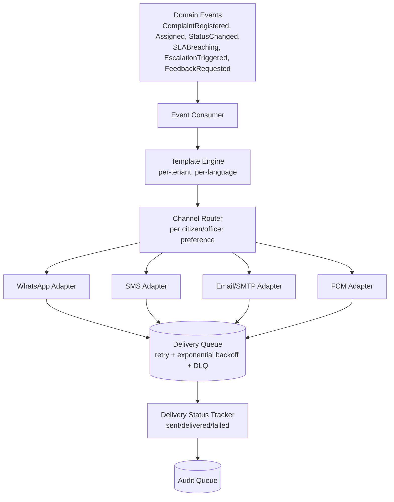

### 10.2 Provider Abstraction (SRS §5, §2.5)

Each channel adapter implements a common interface (`INotificationProvider`) so the concrete provider (Meta Cloud API / Gupshup / Karix / Twilio for WhatsApp; any DLT-registered gateway for SMS) is selected via Tenant & Admin Config, not hardcoded.

### 10.3 Delivery Guarantees

- At-least-once delivery attempt per notification (queue-backed, survives process restart).
- Exponential backoff retry (e.g., 3 attempts: 30s / 2min / 10min) before moving to a dead-letter queue for manual/ops review.
- Every attempt and final outcome is written to the Audit Service (feeds SRS §4.3's 10-year audit log retention).
- Reminders (feedback requests, SLA-nearing-breach nudges) are scheduler-triggered, not event-triggered, and flow through the same pipeline.

---

## 11. Security Architecture

### 11.1 Defense-in-Depth Layers

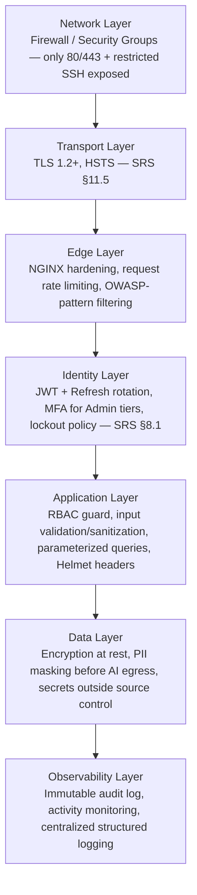

### 11.2 RBAC Model

- **Role** (Citizen / Officer[hierarchy level] / Department Admin / Corporation Admin / Super Admin / read-only future roles) is always evaluated **within a tenant context** — no cross-tenant data access is structurally possible.
- **Permission** = (resource, action) pair, e.g., `complaint:read:own`, `complaint:assign`, `config:department:write`, `audit:read`. Permission sets are tenant-configurable per SRS §7, resolved from the Tenant & Admin Config Service and cached in Redis.
- **Scope** narrows a permission to a data subset: an Officer's scope is their assigned ward/department (per the configurable hierarchy, SRS §6.1); a Department Admin's scope is one department; a Corporation Admin's scope is the whole tenant; a Super Admin's scope spans tenants.

### 11.3 OWASP Top 10 Mapping

| Risk | Mitigation |
|---|---|
| A01 Broken Access Control | RBAC guard on every request; tenant/scope isolation (11.2) |
| A02 Cryptographic Failures | TLS 1.2+/HSTS in transit; encryption at rest for MySQL and file storage; Argon2id password hashing |
| A03 Injection | Parameterized queries/ORM only; input validation & sanitization middleware (4.1) |
| A04 Insecure Design | Config-driven, least-privilege, provider-abstracted architecture (Section 0) |
| A05 Security Misconfiguration | Hardened NGINX/Ubuntu baseline; secrets via environment/vault, never in source |
| A06 Vulnerable/Outdated Components | Dependency scanning (e.g., `npm audit`) in CI pipeline (SRS §11.3) |
| A07 Identification & Auth Failures | MFA for Admin tiers, account lockout, session timeout policy (SRS §8.1) |
| A08 Software/Data Integrity Failures | Lockfile-pinned dependencies, CI build provenance, signed releases |
| A09 Security Logging & Monitoring Failures | Immutable audit trail, centralized structured logging, activity monitoring (SRS §11.4) |
| A10 Server-Side Request Forgery | Outbound allow-list restricted to known external endpoints (Claude, WhatsApp, SMS, SMTP, FCM) — no arbitrary outbound requests |

### 11.4 Encryption

- **In transit**: TLS 1.2+ everywhere, including internal service-to-service calls where they cross VM boundaries (Gateway/app tier on VM-1 → MySQL on VM-2).
- **At rest**: MySQL data-at-rest encryption; encrypted file storage for uploaded images/voice/documents; encrypted backups (SRS §11.4).
- **PII in AI egress**: masked before leaving infrastructure (Section 8.2) — this is a privacy control layered on top of, not a substitute for, transport encryption.

### 11.5 Audit Logging

Every state-changing action (complaint status change, assignment, approval, escalation, config change, login, permission change) emits an audit event, consumed asynchronously (Section 6.2) and written immutably, retained 10 years per SRS §4.3. Audit records are never editable, only appendable.

---

## 12. High Availability Architecture

### 12.1 Honesty Note on Phase-1 Posture

Phase-1's approved infrastructure (SRS §11.1) is **two VMs**: one application server, one database server. This is inherently **not HA** — it is a single active instance per tier with process-level resilience (PM2 auto-restart, MySQL crash recovery). What follows is the **HA target architecture**: designed now, activated incrementally as each additional VM/component is approved, with **zero application redesign** at activation time (per ADR-010, §21). Nothing below is claimed as already running on 2 VMs.

### 12.2 Active/Passive Model, Per Tier

| Tier | Phase-1 (current, 2 VMs) | HA Target (additional infra, no app redesign) |
|---|---|---|
| **App tier** | Single VM-1, PM2-managed process groups | Add **VM-1-Standby**, deployed identically (same PM2 groups); Active serves traffic, Passive stays warm and idle; promoted on Active failure |
| **Database tier** | Single VM-2, MySQL primary | Add a **MySQL Replica** on a new VM (async or semi-synchronous replication); Replica also absorbs read-heavy reporting/analytics queries in normal operation; promoted to primary on failover |
| **Redis tier** | Single Redis instance on VM-1 | **Redis Sentinel** topology (1 master + 2 replicas + sentinel quorum) for automatic failover — required because Redis holds refresh tokens, OTPs, rate-limit state, and in-flight queue jobs (§16); losing it is not a "just a cache" event for this system |
| **Edge tier** | NGINX on VM-1 (single point of entry) | **Load Balancer** (HAProxy, or NIC MeghRaj/cloud LB) in front of 2+ NGINX/app nodes, active health-checked; unhealthy nodes removed from rotation automatically |

### 12.3 Future Load Balancer

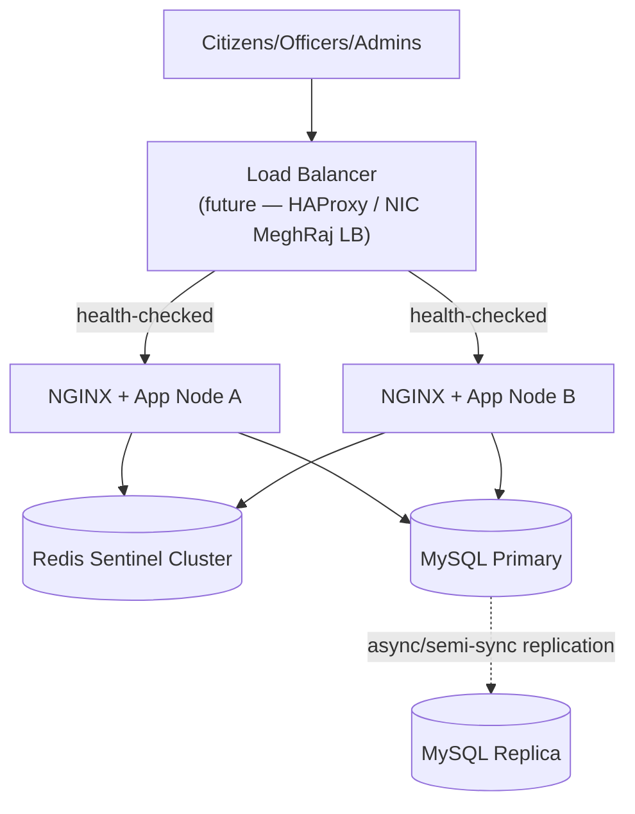

This activates once a second app VM is approved — the LB simply becomes the new front door in place of directly exposing NGINX; **no service code changes**, because every core-api instance is already stateless (ADR-007, §21).

### 12.4 Failover Strategy

| Component | Detection | Failover Action | Phase-1.5 Automation Level |
|---|---|---|---|
| App node | LB/NGINX health check (`/healthz`, §15) | Traffic routed away from unhealthy node automatically | Automated once LB exists |
| Redis | Sentinel quorum (majority of sentinels agree master is down) | Sentinel promotes a replica to master, reconfigures clients | Automated (Sentinel-native) |
| MySQL | Health check + replication lag monitor | Promote replica to primary; update app-tier connection config | **Manual runbook in Phase-1.5** (documented, timed procedure); recommend automated tooling (e.g., Orchestrator + ProxySQL, or a managed MySQL HA offering) as the enterprise-grade next step once budget is approved |

A documented, rehearsed manual MySQL failover runbook is sufficient to meet the **30-minute RTO** (SRS §4.2) as an interim measure; it should not be treated as the permanent end-state for a "government-grade" platform — full automation is the recommended eventual target.

---

## 13. Scalability Architecture

### 13.1 Foundational Enabler: Stateless APIs

Every core-api instance is stateless — no in-memory session or per-user state (ADR-007, §21). All state that must survive a request lives in MySQL (durable) or Redis (fast, shared). This is what makes every scaling tier below achievable by **adding instances**, never by re-architecting.

### 13.2 Scaling by Volume Tier

| Dimension | Tier 1 — 5,000/day (Phase-1 Pilot) | Tier 2 — 50,000/day (Multi-ULB Rollout) | Tier 3 — 5,00,000/day (State-Wide) |
|---|---|---|---|
| **App tier (core-api)** | PM2 cluster mode, single VM, N workers = CPU cores | Multiple app VMs behind Load Balancer (§12.3); still PM2 cluster mode per node | Container orchestration (Kubernetes, SRS §11.2); horizontal pod autoscaling on CPU/request-rate |
| **Redis** | Single instance | Redis Sentinel (HA, §12.2) | Redis Cluster (sharded, HA) — required once single-node throughput/memory becomes the bottleneck |
| **Queues** | Redis-backed queues, single consumer per service | Multiple consumer instances per queue (queue-native load balancing across workers) | Queue partitioning by tenant/region; re-evaluate Redis-queue vs. a dedicated broker (Kafka/RabbitMQ) per ADR-002's migration path if delivery-guarantee/partitioning needs outgrow Redis |
| **MySQL** | Single primary | Primary + read replica(s) for reporting/analytics queries; writer stays single | Read replica fan-out **plus** tenant-based sharding (natural boundary — each ULB's data is already tenant-isolated, ADR-005) for write scaling |
| **AI Service (Claude)** | Single ai-service instance, queue absorbs bursts | Multiple ai-service instances consuming the same queue | Multiple instances **plus a shared, Redis-backed global rate limiter/token-bucket** in front of the Claude adapter — horizontal scaling of workers does not help if the upstream Claude API itself is rate-limited; backpressure must be coordinated across all instances, not per-instance |
| **Whisper (Voice Service)** | Single voice-service instance, CPU-bound | Multiple voice-service instances, queue-buffered | Multiple instances, GPU-accelerated where available; queue depth monitored (§15) so transcription lag is visible and alertable rather than silently growing |
| **Notification Service** | Single instance | Multiple instances, per-channel worker pools (WhatsApp/SMS/Email/Push scale independently since each has its own provider rate limits) | Same, with per-tenant/per-channel partitioning to prevent one tenant's or one channel's backlog from starving another's |

### 13.3 Why This Doesn't Require Redesign

Because inter-service communication is already queue-based (§6.2) rather than tightly-coupled synchronous chains, adding consumer instances at any tier is a **deployment change**, not a code change — this is the direct payoff of the architectural principles in Section 0.

---

## 14. Disaster Recovery Architecture

### 14.1 Targets (Restated from SRS §4.2)

**RTO: 30 minutes · RPO: 15 minutes.**

### 14.2 Backup Strategy by Data Type

| Data Type | Backup Method | Frequency | Retention Alignment |
|---|---|---|---|
| **MySQL (all relational data)** | Daily full backup + continuous binary-log shipping (enables point-in-time restore within the 15-min RPO) | Continuous (binlog) + daily (full) | Operational backups on a rolling window (e.g., 90 days); long-term archival aligned to SRS §4.3 (10 years for complaints/audit/documents, 2 years application logs) |
| **Redis** | AOF (append-only file) persistence for durability of refresh tokens and **in-flight queue jobs** + periodic RDB snapshot | Continuous (AOF) + hourly (RDB) | Short-lived by nature (tokens/queues) — Redis is not a system of record; MySQL and file storage are the durable source of truth |
| **Uploaded Files (Images, Documents)** | Scheduled sync to offsite/object storage target | Daily | 10 years (SRS §4.3) |
| **Voice Recordings** | Scheduled sync to offsite/object storage target, encrypted | Daily | 5 years (SRS §4.3) |
| **Audit Attachments** | Same pipeline as Uploaded Files, but never purged before the audit log's own retention | Daily | 10 years, tied to audit log lifecycle (§19.2) |

### 14.3 Offsite Backup

Phase-1's 2-VM budget does not include a third, geographically separate storage target. **Recommended Default**: an offsite/object storage destination (e.g., NIC MeghRaj object storage or a separate data center) for all backup categories above — this is infrastructure **beyond the currently approved 2-VM footprint** and is flagged here for the same reason SRS §11.4 flagged it: it needs explicit approval, not silent assumption. Until approved, VM-2's backup agent output should at minimum be replicated to VM-1 (different physical VM) as an interim, non-offsite mitigation.

### 14.4 Restore Strategy (Runbook Outline)

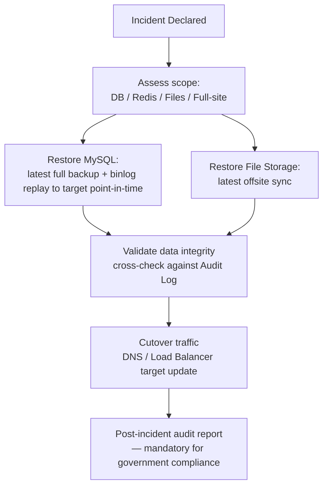

### 14.5 DR Drills

**Recommended Default**: quarterly restore drills (restore from backup into an isolated environment and verify integrity) — standard practice for STQC readiness (SRS §9) and the only reliable way to know the 30-minute RTO is actually achievable rather than theoretical.

---

## 15. Observability Architecture

| Capability | Design |
|---|---|
| **Application Logging** | Structured JSON logs (e.g., Winston/Morgan) per service, with a **correlation/trace ID** generated at the Gateway and propagated through every internal call and queue-job payload, so a single citizen request can be followed across core-api → ai-service/voice-service/notification-service |
| **Audit Logging** | As designed in §11.5 — immutable, 10-year retention, append-only, separate from application logs |
| **Error Logging** | Centralized error capture with stack traces; **PII-sanitized before storage** (consistent with §8.2's masking principle — an error log must never become a PII leak vector) |
| **Distributed Tracing** | **Recommended Default**: OpenTelemetry-compatible instrumentation, exportable to a tracing backend (e.g., Jaeger or Grafana Tempo) once that infra is approved; the correlation ID above is the minimum viable version of this, usable even before a full tracing backend exists |
| **Performance Monitoring** | Per-endpoint response time/throughput; per-queue depth and consumer lag; per-query DB latency |
| **Health Checks** | Each PM2 process group exposes a `/healthz` endpoint — used by PM2 today, and by the future Load Balancer (§12.3) for automated failover |
| **Metrics** | Prometheus-style exporters per service: request rate/error rate/latency (RED method), queue depth, Claude API call latency and token cost, Whisper processing time — visualized via a dashboard (e.g., Grafana), per SRS §11.4 |
| **Alerting** | Threshold-based alerts (ops channel, distinct from the citizen-facing Notification Service) on: SLA breach rate spike, queue backlog growth, error rate spike, CPU/memory/disk thresholds, Claude API failure rate, notification delivery failure rate |

---

## 16. Redis Architecture

Redis is a **multi-purpose, shared-state backbone** for the stateless app tier (§13.1) — not "just a cache." Each usage is logically isolated (by key-namespace, not by separate Redis instances, in Phase-1 — namespace isolation is sufficient at this scale and avoids operating multiple Redis processes on a 2-VM budget):

| Usage | Purpose | Persistence Need |
|---|---|---|
| **JWT** | Not stored (JWTs are self-contained, signature-verified) — Redis holds a **denylist of revoked/logged-out tokens**, TTL matching the token's remaining life | Low — TTL-bounded by design |
| **Refresh Tokens** | Server-side record keyed by token ID, enabling rotation and revocation (§7.3) | **High** — AOF persistence required; losing this forces re-authentication for all active users |
| **OTP** | Hashed OTP, 5-minute TTL, single-use, keyed by mobile + purpose | Low — short TTL, low blast radius if lost |
| **Rate Limiting** | Token-bucket/sliding-window counters per IP/user/tenant at the Gateway | Low — resets are self-healing |
| **Caching (Config)** | Tenant/Admin config (departments, hierarchy, SLA rules, templates) cached with short TTL + explicit invalidation on config write, avoiding a MySQL round-trip on every request | Low — MySQL is the source of truth |
| **AI Response Cache** | Officer AI Agent / Analytics Agent repeated-query results (§8.3) | Low — cache-miss just costs a Claude call |
| **Queues** | All async job dispatch (§6.2, §18) | **High** — AOF persistence required; a lost queue job is a lost/delayed complaint-processing step |
| **Sessions** | Not classic server-rendered sessions (auth is stateless JWT) — used for **active-session bookkeeping** where an Admin security feature requires it (e.g., concurrent-session limits, forced logout of all sessions on password change) | Medium |
| **Locks** | Distributed locks (Redlock-pattern) for: (a) **scheduler leader election** — only one scheduler instance fires a given cron job when horizontally scaled (§13.2 Tier 2+); (b) preventing **double-assignment race conditions** in the Assignment Engine | Low — locks are inherently short-lived |

**Persistence configuration**: AOF enabled for durability of Refresh Tokens and Queues (the two categories where data loss has real workflow consequences); RDB snapshots for general point-in-time recovery. This ties directly into §12.2's Redis Sentinel HA design and §14.2's backup strategy.

---

## 17. Scheduler Architecture

All scheduled jobs run via node-cron inside the `scheduler` PM2 process group (§3.2), guarded by a **Redis distributed lock** (§16) so that horizontal scaling of the scheduler tier (Tier 2+, §13.2) never causes a job to fire twice.

| Job | Trigger (Recommended Default) | Responsible Service | Purpose |
|---|---|---|---|
| **SLA Monitor** | Every 5 minutes | Assignment & SLA Engine | Scan open complaints against configured SLA thresholds; flag nearing/breached |
| **Auto Escalation** | Triggered by SLA Monitor findings | Assignment & SLA Engine | Escalate to next hierarchy level per the configurable Escalation Matrix (SRS §3.4); publish notification event |
| **Reminder Notifications** | Daily | Notification Service | Pending-feedback nudges to citizens; upcoming-deadline nudges to officers |
| **Daily Reports** | Nightly (e.g., 01:00) | Analytics & Reporting Service | Department/ward daily summary |
| **Weekly Reports** | Weekly (e.g., Monday 02:00) | Analytics & Reporting Service | Officer performance report, department weekly summary (feeds Officer AI Agent's report-generation query, SRS §3.3) |
| **Monthly Reports** | Monthly (1st, 03:00) | Analytics & Reporting Service | District/department monthly reports (SRS Analytics Agent, §3.5) |
| **Archive Jobs** | Monthly | Media Service + Complaint Service | Move records past the "hot" operational window (e.g., 2 years) into a cheaper archival tier, **without deleting** — respecting the full 10-year retention (SRS §4.3), still queryable |
| **Cleanup Jobs** | Hourly (OTP/rate-limit expiry) + Daily (temp files, §19.4) + per-retention-schedule (permanent deletion where legally due) | Auth Service / Media Service | Purge expired OTPs and rate-limit counters; purge unfinalized temp uploads (§19.4); execute **retention-expiry deletion**, each deletion itself written to the Audit Log before the data is removed |

---

## 18. Agent Communication Architecture

### 18.1 Communication Contract

Agents **never call each other directly** (no agent-to-agent synchronous HTTP). All coordination happens through **named Redis queues** carrying a standard event envelope: `{ eventType, tenantId, correlationId, payload, timestamp, retryCount }`. The one exception is the **Officer AI Agent**, which is synchronous request/response by nature — an officer is actively waiting for an answer to a natural-language query — but even it is served by the same AI Orchestration Service and PII-masking gate as the async agents.

### 18.2 Queue Map

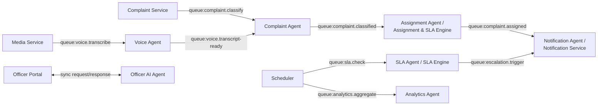

### 18.3 Retry, Failure Handling, Timeout

| Concern | Design |
|---|---|
| **Retry** | Per-queue policy, e.g., 3 attempts with exponential backoff (30s / 2min / 10min) — same pattern as Notification Service (§10.3), applied uniformly across all agent queues |
| **Idempotency** | Every consumer is written to be safely re-runnable on the same event (e.g., Assignment Engine checks "is this complaint already assigned?" before assigning) — required because at-least-once delivery means duplicates are possible |
| **Failure Handling** | Exhausted retries move the job to a **per-queue dead-letter queue**, which triggers an ops alert (§15) and is available for manual reprocessing; for the Complaint Agent specifically, exhaustion falls back to **manual officer categorization** (§8.3) rather than leaving a complaint permanently unclassified |
| **Timeout** | Explicit per-call timeouts prevent a slow external dependency from starving a worker: Claude calls ~30s, Whisper transcription capped relative to audio length (e.g., 2× real-time duration), synchronous DB operations ~5s. A timeout is treated as a failure for retry purposes, not a hang |

---

## 19. File Storage Architecture

### 19.1 Storage by Asset Type

| Asset | Phase-1 Location | Retention (SRS §4.3) | Notes |
|---|---|---|---|
| Complaint Images | VM-1 local disk, outside webroot | 10 years | Accessed only via signed, short-lived URLs (§8.2) |
| Voice Recordings | VM-1 local disk, encrypted | 5 years | Never leaves infra unmasked/untranscribed (§9.1) |
| Officer Evidence Documents | VM-1 local disk, outside webroot | 10 years | Same validation pipeline as citizen uploads (§8.2) |
| Audit Attachments | VM-1 local disk, outside webroot | 10 years, tied to audit record lifecycle — **never purged ahead of the audit log itself**, even if the related complaint's own retention would otherwise allow it | |
| Temporary/In-Transit Files | Quarantine directory, separate from permanent storage | Auto-purged after 24 hours if not finalized | Prevents unscanned/unvalidated files from ever becoming reachable as "permanent" |

### 19.2 File Lifecycle

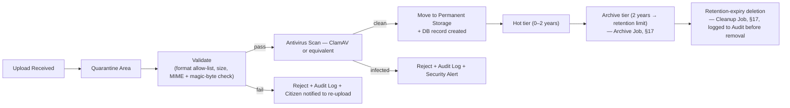

### 19.3 Future State

Local disk is a Phase-1 constraint (SRS §11.1's 2-VM footprint, no object storage in scope). The Media Service already exposes a storage abstraction (Section 0, Principle 3) — moving to S3-compatible object storage (MinIO, or NIC MeghRaj object storage) is an **adapter swap**, not an application change (ADR-009, §21).

---

## 20. Future Integrations Architecture

Every row below is an **extension point**, not a built feature — designed so each can be added later without touching the architecture described in Sections 1–19.

| Integration | Extension Point | Hosted By | Why No Redesign Is Needed |
|---|---|---|---|
| **GIS / Google Maps / OpenStreetMap** | Pluggable `ILocationProvider` consuming the existing `ComplaintClassified` event's location output (SRS §3.5) | New enrichment consumer alongside Complaint Service | The Complaint Agent already produces structured location data; a map provider only enriches it (lat/long, ward-boundary lookup) — it doesn't change the event contract |
| **WhatsApp / Email / SMS (additional providers)** | `INotificationProvider` adapter (§10.2) | Notification Service | Already provider-abstracted; new provider = new adapter + Admin Portal config entry |
| **Mobile App / Citizen App** | Same REST API surface behind the API Gateway | API Gateway + all core-api services | core-api is already a stateless API consumed by a web frontend; a native app is just another client. Push already routes via FCM (§10) |
| **IoT Sensors (e.g., flood/water-level sensors)** | A new **IoT Ingestion Adapter** that translates sensor payloads into a well-formed `ComplaintRegistered`-shaped event | New lightweight ingestion service, publishing onto the existing queue (§18.2) | The event-driven pipeline doesn't care what produced the event — any new input channel just needs to emit the same event shape |
| **CCTV / Drone Inspection** | Same IoT Ingestion Adapter pattern, with image/video attached via the existing Media Service upload contract | New ingestion service + existing Media Service | Reuses the file validation/storage pipeline (§8.2, §19) unchanged |
| **Government APIs / e-Sevai / TNeGA (SSO federation)** | New `Government Integration Service`, issuing citizens/officers through the **same Auth Service JWT contract** | Auth Service boundary | Downstream services only ever see "an authenticated JWT for tenant X" — they don't know or care whether the citizen authenticated via Mobile OTP or a future e-Sevai/TNeGA SSO federation |
| **DigiLocker** | New adapter behind a `IDocumentSourceProvider`, feeding into the existing Media Service document-attachment flow | Media Service | Same validation/storage contract as any other document upload — only the *source* of the file differs |
| **Aadhaar (e-KYC)** | New authentication method added to Auth Service, alongside (not replacing) Mobile OTP (SRS §2.5's Phase-1 constraint) | Auth Service | Isolated behind the Auth Service exactly like ADR-007's stateless-JWT design intends — a new verification method still ends in the same JWT issuance step |

---

## 21. Architecture Decision Records (ADR)

| ID | Decision | Why Selected | Alternatives Considered | Reason Rejected | Future Migration Path |
|---|---|---|---|---|---|
| **ADR-001** | Logical microservices consolidated into 5 PM2 process groups for Phase-1 (not full Kubernetes microservices) | Fits the approved 2-VM budget (SRS §11.1); PM2 gives clustering/auto-restart at near-zero infra cost; keeps the "AI Service: NodeJS" tech-stack separation intact | (a) Single monolith Express app; (b) Full Kubernetes microservices from day one | (a) Would couple Claude/Whisper latency to the citizen-facing request path and contradict the separate-runtime tech stack; (b) over-engineered operational burden not justified for a first pilot | Each PM2 group → own container image → Kubernetes pods (SRS §11.2), no code change |
| **ADR-002** | Redis-backed async queues instead of synchronous service-to-service chaining | Keeps complaint registration fast (instant Tracking ID); isolates slow/external dependencies; enables independent per-consumer scaling (§13) | Synchronous REST chaining; a dedicated broker (Kafka/RabbitMQ) from day one | Sync chaining risks request timeouts at peak volume; a dedicated broker is unjustified operational overhead when Redis is already required for caching | Swap transport behind the internal publishing interface to Kafka/RabbitMQ at Tier-3 scale (§13.2) if needed |
| **ADR-003** | Claude API (hosted) with a mandatory PII-masking gate, instead of a self-hosted LLM, for Phase-1 | Avoids GPU/hosting cost not budgeted in Phase-1; masking makes hosted-API use compliant with the DPDP-driven privacy rule (SRS §10) | Self-host an open-source LLM from day one | Production-quality self-hosted inference needs GPU infra not part of the approved Phase-1 footprint | `IAIProvider` interface (§8.1) already isolates this — swap adapter when on-prem LLM infra is approved |
| **ADR-004** | Self-hosted Whisper instead of a hosted speech-to-text API | Audio can contain spoken PII that **cannot be text-masked before transcription** — a hosted STT API would receive raw, unmasked audio, violating the core AI-privacy rule | Hosted STT API with post-transcription masking only | Masking is only possible on text, not audio — the privacy rule would already be broken by the time masking could apply | None needed — compliance-driven, not cost-driven; only the self-hosted model version is expected to change |
| **ADR-005** | Officer hierarchy and departments stored as tenant configuration data, not schema/enums | SRS §1.3/§7 requires the same codebase to serve future ULBs with different structures without code change | Hardcode Tambaram's hierarchy/departments directly (faster for a single-tenant pilot) | Would directly contradict the multi-tenant/no-hardcoding requirement and force a rewrite for the second ULB | N/A — this is the Phase-1 design itself |
| **ADR-006** | MySQL (single primary, relational) instead of a NoSQL/document store | Matches the given tech stack; grievance workflow needs strong consistency (SLA timers, approval chains, audit trail) that relational/ACID guarantees serve well | NoSQL document store (e.g., MongoDB) | Not part of the given tech stack; eventual consistency is a poor fit for SLA/approval/audit correctness requirements | Read replicas, then tenant-based sharding at Tier-3 scale (§13.2) — not a paradigm change |
| **ADR-007** | Stateless JWT authentication instead of server-side session store | Enables horizontal scaling without sticky sessions — any app instance can validate any request (§13.1) | Server-side session (cookie + session ID looked up per request) | Session affinity complicates load balancing; stateless JWT + a Redis revocation denylist (§16) gives the same force-logout capability without the coupling | None needed |
| **ADR-008** | Redis for queues (BullMQ-style) instead of a dedicated message broker in Phase-1 | Redis is already required for caching/sessions/rate-limiting; reusing it avoids a second infra component on the 2-VM budget | RabbitMQ, Kafka, or an equivalent managed queue from day one | Unjustified operational overhead at Tier-1 volume (5,000/day, §13.2) | Same migration path as ADR-002 |
| **ADR-009** | Local disk file storage in Phase-1 instead of object storage (S3/MinIO) from day one | No object storage service is part of the approved Phase-1 infrastructure (SRS §11.1) | Object storage from day one | Would require infrastructure approval beyond what's currently granted | Media Service's storage abstraction (§19.3) already isolates this — adapter swap only |
| **ADR-010** | Active/Passive HA target model instead of Active/Active | Operationally simpler to audit (single source of truth at any moment); achievable incrementally without a full rewrite; avoids multi-primary MySQL write-conflict complexity | Active/Active multi-primary from the start | Multi-primary write-conflict resolution is significant added risk for a government system where correctness/auditability outweighs marginal availability gain at pilot scale | Read-scaled Active/Active (single writer, multiple read-serving replicas) can be introduced at Tier-3 scale once automated failover tooling (§12.4) is in place |

---

## 22. Explicitly Out of Scope for This Document

- Database schema/table design (separate deliverable, per your instruction).
- Redis key-naming conventions and exact TTL values (implementation detail; usage patterns are covered in §16).
- Exact cron expressions and job-parameter tuning (implementation detail; job catalogue and cadence intent are covered in §17).
- Any code, schema DDL, or API contract specification.
- Selection of a specific Load Balancer product, object storage product, or tracing backend product (§12–§15 describe the architectural role and give examples; procurement/product selection is a separate decision).

---

## 23. Approval

This System Architecture (v1.0) must be reviewed and approved before proceeding to Database Design or any further detailed design/build activity.
