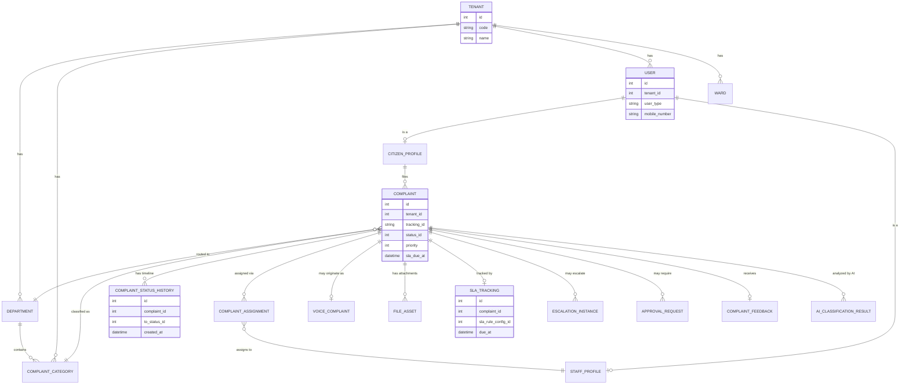
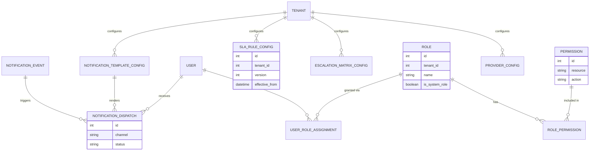
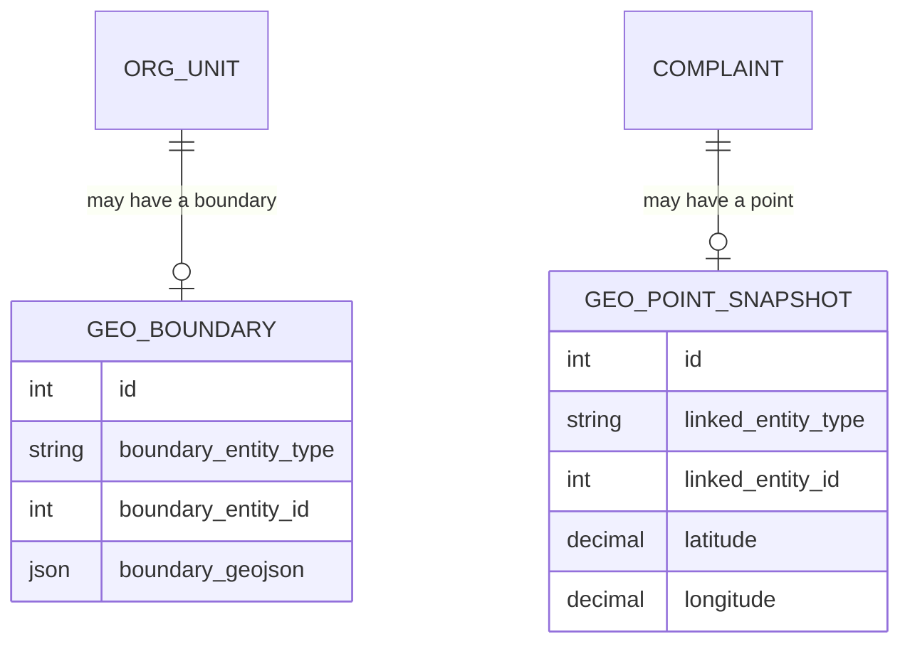
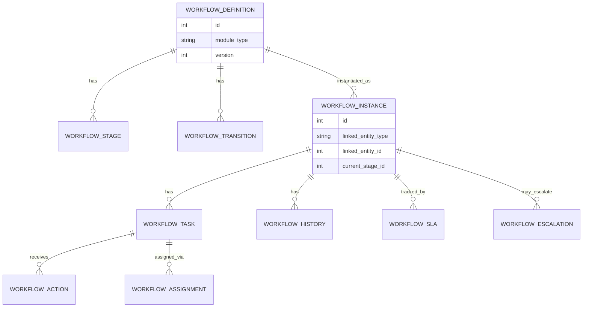

# Database Architecture & Design Document

## AI Powered Enterprise Citizen Service & Grievance Management Platform

| | |
|---|---|
| **Document Status** | v1.0 **Approved in Principle** · v1.1 Enterprise Extension — Pending Client Review |
| **Version** | 1.1 |
| **Date** | 2026-07-20 |
| **Based On** | `docs/SRS.md` v0.2, `docs/ARCHITECTURE.md` v1.0, `docs/INFRASTRUCTURE_DEVOPS.md` v1.0 (all Approved); Database Architecture & Design Document v1.0 (Approved in Principle) |
| **Pilot Deployment** | Tambaram City Municipal Corporation, Tamil Nadu, India |

> **Scope**: This is a conceptual/logical database design — entities, relationships, and strategy. **No SQL, no `CREATE TABLE` statements, no migrations, no code.** Table and column names below are logical identifiers used to communicate design intent, not DDL. Physical implementation (exact MySQL types, constraints syntax, migration scripts) is a separate, later deliverable.

> **v1.1 Change Note**: v1.0 (Sections 1–25) is **approved in principle and unchanged** in this revision — no entity is redesigned, renamed, or removed, and no architectural decision from `ARCHITECTURE.md` is altered. This revision is a **strict addition**: Sections 26–34 below are the output of a final Enterprise Database Architecture Review, adding forward-looking capability (GIS, a generic workflow engine, expanded org hierarchy, centralized reference data, richer file metadata, enterprise search, data-dictionary/governance standards, and AI-readiness) as new, optional, or dormant-until-activated entities that sit alongside the v1.0 schema. Where a new capability could be satisfied by reusing an existing v1.0 table or pattern (e.g. `provider_config`, `feature_flag_config`, the polymorphic `linked_entity_type`/`linked_entity_id` convention), this revision reuses it rather than inventing a parallel mechanism.

### Version History

| Version | Date | Summary |
|---|---|---|
| 1.0 | 2026-07-19 | Original conceptual/logical database design — Approved in Principle |
| 1.1 | 2026-07-20 | Enterprise Database Architecture Review: adds GIS/Geospatial (§26), Generic Workflow Engine (§27), Organization Hierarchy Model (§28), Reference Data Architecture (§29), Enterprise File Metadata (§30), Enterprise Search (§31), Data Dictionary Standards (§32), Database Governance (§33), Future AI Database Readiness (§34). No changes to Sections 1–25. |

---

## 1. Database Design Principles

1. **Relational/ACID by design intent** — grievance workflow (SLA timers, approval chains, escalation, audit trail) needs strong consistency; this is the reasoning already recorded in `ARCHITECTURE.md` ADR-006, carried into the schema itself.
2. **Config-driven, not schema-driven, for anything tenant-variable** — departments, officer hierarchy, complaint categories/status, SLA rules, escalation matrix, notification templates, and provider selection are **rows in configuration tables**, never native `ENUM` types or hardcoded lookup values (SRS §7). A second Urban Local Body must be onboarded by inserting rows, never by altering schema.
3. **Multi-tenant isolation at the row level** — every tenant-scoped table carries a `tenant_id`; there is no tenant that is "special-cased" in schema (Section 3).
4. **Surrogate keys internally, natural keys for citizens/officers** — every table has a system-generated primary key; business-facing identifiers (Complaint Tracking ID, SRS §3.8) are unique, indexed, but never the primary key (Section 4).
5. **Immutability where correctness demands it** — Audit Log, Complaint Timeline, and versioned configuration history are append-only; nothing in this category is ever `UPDATE`d in place (Sections 17, 21, 22).
6. **Soft delete as the default, hard delete as the compliance-only exception** — an admin action never silently erases data; only the automated, audited retention-expiry process performs a real delete (Section 21).
7. **The database is the boundary where unmasked citizen data lives** — original complaint text/voice always exists here in full; only masked copies ever leave for AI processing (`ARCHITECTURE.md` §8.2, §10). This document flags which columns carry that sensitivity (Section 24).
8. **Every table traces to a requirement** — nothing below exists because "a grievance system usually has this"; each entity is justified against SRS/Architecture functionality already approved.

---

## 2. Naming Standards

| Element | Convention | Example |
|---|---|---|
| Table names | `snake_case`, **singular** noun (Recommended Default — one row = one entity instance) | `complaint`, `department`, `officer_hierarchy_level` |
| Primary key column | Always `id` | `complaint.id` |
| Foreign key column | `<referenced_entity>_id` | `complaint.department_id` |
| Junction/mapping tables | `entity_a_entity_b` | `role_permission`, `user_role_assignment` |
| History/append-only tables | Suffix `_history` or `_log` | `complaint_status_history`, `audit_log` |
| Configuration tables | Suffix `_config` where the table exists purely to hold tenant-tunable settings | `sla_rule_config`, `notification_template_config` |
| Boolean columns | Prefix `is_` / `has_` | `is_active`, `has_attachments` |
| Timestamp columns | `created_at`, `updated_at`, `deleted_at` (soft delete, nullable) | — |
| Tenant scoping column | `tenant_id` on every tenant-scoped table, always the **first** column in composite indexes (Section 18) | — |
| Enum-like values | Foreign key to a master/config table, **not** a native `ENUM` column, wherever the value set is tenant-variable (Principle 2) | `complaint.status_id → complaint_status_definition.id` |

---

## 3. Multi-Tenant Strategy

**Recommended Default: Shared database, shared schema, `tenant_id` discriminator column** on every tenant-scoped table — not schema-per-tenant, not database-per-tenant.

| Option | Verdict | Reasoning |
|---|---|---|
| Database-per-tenant | Rejected | Operationally unworkable once dozens/hundreds of Tamil Nadu ULBs onboard (SRS §1.3) — every migration must run N times, N connection pools to manage |
| Schema-per-tenant | Rejected | Same migration-multiplication problem at a smaller scale; still doesn't compose with the "single MySQL primary" decision in `ARCHITECTURE.md` ADR-006 |
| **Shared schema + `tenant_id`** | **Selected** | Standard SaaS multi-tenancy pattern; one schema to migrate and reason about; `tenant_id` is also the natural future shard key if Tier-3 scale (`ARCHITECTURE.md` §13.2) ever requires tenant-based sharding — no redesign, just a routing layer added later |

**Enforcement**:
- Every tenant-scoped table's primary business uniqueness constraint is **composite**: `(tenant_id, business_key)` — e.g., department code is unique *within* a tenant, never globally.
- Every application query is scoped by `tenant_id` at the Data Access Layer (`ARCHITECTURE.md` §4.1) — this document defines the schema shape that makes that scoping possible and cheap (composite indexes leading with `tenant_id`, Section 18).
- A small number of entities are **not** tenant-scoped by nature: `permission` (global RBAC catalog) and a `user` record for a Super Administrator whose access spans tenants (Section 5) — these are the deliberate, documented exceptions, not an inconsistency.

---

## 4. Entity Identification

| Concern | Design |
|---|---|
| **Internal primary key** | Surrogate, system-generated, auto-incrementing integer identifier on every table — optimal for InnoDB index locality/join performance at Tier-2/3 write volumes (`ARCHITECTURE.md` §13.2) |
| **External/public identifier** | Entities ever exposed outside the database boundary — referenced in API responses, queue events (`ARCHITECTURE.md` §18.1's event envelope), or citizen-facing contexts — additionally carry a non-sequential external identifier (e.g., `user`, `complaint`). This avoids exposing a guessable sequential ID externally (an enumeration-attack surface, OWASP A01, `ARCHITECTURE.md` §11.3) while keeping the internal join key fast |
| **Citizen-facing natural key** | The Complaint **Tracking ID** (SRS §3.8 format: `{TenantCode}-{DeptCode}-{YYYYMM}-{SequenceNumber}`) is a **unique indexed business key**, deliberately *not* the primary key — tracking-ID generation depends on a per-tenant-per-month sequence and must remain stable and citizen-quotable even as the underlying row is partitioned/archived over its 10-year retention (Sections 19–20) |
| **Tenant-scoped uniqueness** | Every natural/business key's uniqueness constraint is composite with `tenant_id` (Section 3) — never a bare global unique constraint |

---

## 5. Master Tables

Relatively slow-changing entities that define *who and where* — the organizational and geographic backbone. Distinguished from Configuration Tables (Section 7), which hold *behavior-tuning* settings that change more frequently and are versioned.

| Entity | Purpose | Key Attributes (conceptual) | Key Relationships |
|---|---|---|---|
| `tenant` | One row per onboarded ULB/Corporation/District/State Department (SRS §1.3) | code, name, tenant_type, state, status | Root of all tenant-scoped data |
| `department` | Tenant-configurable department list (SRS §6.2) | tenant_id, code, name, is_active | Belongs to `tenant`; referenced by `complaint_category`, `officer_hierarchy_level` scoping |
| `officer_hierarchy_level` | Tenant-configurable hierarchy (SRS §6.1) | tenant_id, level_order, title | Belongs to `tenant`; referenced by `staff_profile` |
| `district` / `zone` / `ward` | Tenant-configurable geographic hierarchy (SRS §7) | tenant_id, parent reference, name, code | Self-referential geographic tree per tenant |
| `complaint_category` | Tenant-configurable complaint categories (SRS §3.4) | tenant_id, department_id, name, default_priority | Belongs to `department`; referenced by `complaint` |
| `user` | Base identity for every human actor — Citizen, Officer, all Admin tiers | tenant_id (nullable for cross-tenant Super Admin), external_uuid, user_type, mobile_number, email, username, password_hash (staff only), status | Root of `citizen_profile` / `staff_profile` (1:1, discriminated by `user_type`) |
| `citizen_profile` | Citizen-specific attributes | user_id, name, address, preferred_language, ward_id | 1:1 with `user` where `user_type = citizen` |
| `staff_profile` | Shared profile for Officer, Department Admin, Corporation Admin, Super Admin (Section 17 explains this consolidation) | user_id, department_id (nullable), hierarchy_level_id (nullable), scope_type, scope_id, employee_id | 1:1 with `user` where `user_type ≠ citizen` |
| `role` | RBAC role catalog — system-defined (Citizen, Officer, Dept Admin, Corp Admin, Super Admin, and the read-only future roles from SRS §6.4) | tenant_id (nullable for global system roles), name, is_system_role | Referenced by `user_role_assignment` |
| `permission` | Global RBAC permission catalog (resource + action pairs) | resource, action, description | Referenced by `role_permission` |

---

## 6. Transaction Tables

The frequently-written, operational core — the tables under the heaviest read/write load at Tier-2/3 scale (`ARCHITECTURE.md` §13.2).

| Entity | Purpose | Key Attributes (conceptual) | Key Relationships |
|---|---|---|---|
| `complaint` | Core grievance record | tenant_id, tracking_id (unique), citizen_id, department_id, category_id, status_id, priority, severity, language, location (structured), current_officer_id, sla_due_at, created_at, resolved_at, closed_at | Central entity — referenced by nearly every other table in this section |
| `complaint_status_history` | Append-only timeline of every status change (SRS §3.2 Timeline) | complaint_id, from_status_id, to_status_id, changed_by, note, created_at | Belongs to `complaint`; never updated, only inserted |
| `complaint_assignment` | Officer assignment record; a new row per (re)assignment, not an update-in-place | complaint_id, officer_id, assigned_by (system/Assignment Engine or manual), assigned_at, unassigned_at | Belongs to `complaint` and `staff_profile` |
| `voice_complaint` | Voice-channel metadata for a complaint originated by voice (SRS §3.6) | complaint_id, file_asset_id, detected_language, duration_seconds | 1:1 (or 1:many if re-recorded) with `complaint`; references `file_asset` |
| `complaint_feedback` | Citizen post-resolution feedback (SRS §3.2) | complaint_id, rating, comment, submitted_at | Belongs to `complaint` |

---

## 7. Configuration Tables

Tenant-tunable **behavior** settings — versioned (Section 22), never silently overwritten, because a past complaint must remain explainable against the rules that actually applied to it at the time.

| Entity | Purpose | Key Attributes (conceptual) | Key Relationships |
|---|---|---|---|
| `complaint_status_definition` | Tenant-configurable status values and allowed transitions (SRS §3.4) | tenant_id, code, label, sort_order | Referenced by `complaint.status_id` |
| `sla_rule_config` | SLA resolution-time targets per department/category/priority (SRS §3.4), versioned | tenant_id, department_id, category_id, priority, resolution_hours, version, effective_from, effective_to | Referenced by `sla_tracking` (Section 8) |
| `escalation_matrix_config` | Escalation rules — from/to hierarchy level, trigger condition (SRS §3.4), versioned | tenant_id, department_id, from_level_id, to_level_id, trigger_condition, escalate_after_hours, version, effective_from, effective_to | Referenced by `escalation_instance` (Section 8) |
| `approval_workflow_config` | Which categories/departments require multi-level approval, and at which hierarchy level (SRS §3.3), versioned | tenant_id, category_id, required_level_id, version, effective_from, effective_to | Referenced by `approval_request` (Section 8) |
| `notification_template_config` | Per-tenant, per-channel, per-language message templates (SRS §3.4), versioned | tenant_id, event_type, channel, language, body_template, version | Referenced by `notification_dispatch` (Section 11) |
| `provider_config` | Selected AI / Voice / WhatsApp / SMS / SMTP provider per tenant (SRS §7); **credentials are a secrets-manager reference, never a raw value** (`INFRASTRUCTURE_DEVOPS.md` §7) | tenant_id, provider_type, provider_name, secret_reference, is_active | Consulted by AI Orchestration Service / Notification Service (`ARCHITECTURE.md` §3) |
| `feature_flag_config` | Tenant-scoped feature flags (`INFRASTRUCTURE_DEVOPS.md` §16) | tenant_id, flag_key, is_enabled, flag_type | Consulted at request time by application services |

---

## 8. Workflow Tables

**Instances** of the processes defined by Configuration Tables — the "this specific complaint went through this specific approval/escalation," as opposed to "this is the rule."

| Entity | Purpose | Key Attributes (conceptual) | Key Relationships |
|---|---|---|---|
| `approval_request` | An instance of a required approval step for a specific complaint | complaint_id, workflow_config_id, requested_level_id, status, requested_at | Belongs to `complaint`; references `approval_workflow_config` |
| `approval_action` | An individual approver's decision on an `approval_request` | approval_request_id, approver_id (staff_profile), decision, comment, decided_at | Belongs to `approval_request` |
| `escalation_instance` | A record of an actual escalation event that occurred on a complaint | complaint_id, escalation_config_id, from_level_id, to_level_id, reason, triggered_at | Belongs to `complaint`; references `escalation_matrix_config` |
| `sla_tracking` | The computed, complaint-specific SLA due date and breach status, derived from `sla_rule_config` at assignment time | complaint_id, sla_rule_config_id (the specific **version** in effect), due_at, breached_at (nullable) | Belongs to `complaint`; references the versioned `sla_rule_config` row, not "whatever the current rule is" |
| `officer_workload` | Current active-assignment count per officer — read/written by the Assignment Engine (`ARCHITECTURE.md` §3) | officer_id, active_complaint_count, last_updated_at | References `staff_profile`; effectively a materialized counter, not a historical table |

---

## 9. AI Tables

Records of what the AI layer did — necessary for the cost governance and PII-compliance evidence already designed in `ARCHITECTURE.md` §8.3/§8.2, **without ever storing unmasked PII in these tables** — they log *that* masking happened and *what type* was found, never the PII value itself.

| Entity | Purpose | Key Attributes (conceptual) | Key Relationships |
|---|---|---|---|
| `ai_classification_result` | Complaint Agent output — category/priority/department/severity/location/language detected, with confidence | complaint_id, agent_type, detected_category_id, detected_priority, detected_severity, detected_language, confidence_score, created_at | Belongs to `complaint` |
| `ai_agent_invocation_log` | Every call to the AI provider — for cost/latency/failure governance (`ARCHITECTURE.md` §8.3) | tenant_id, agent_type, provider_name, prompt_token_count, response_token_count, latency_ms, status, created_at | Not linked to raw prompt content — only metadata |
| `pii_masking_log` | Evidence that the mandatory masking gate ran, and which PII **types** (never values) were found, for a given complaint (SRS §10) | complaint_id, pii_types_detected (e.g., Aadhaar/PAN/Mobile — a list of type codes, not values), masked_at | Belongs to `complaint`; the compliance artifact proving the masking pipeline is not bypassable |
| `voice_transcript` | Whisper output — transcript text, detected language, confidence (`ARCHITECTURE.md` §9) | voice_complaint_id, transcript_text, detected_language, confidence_score, created_at | Belongs to `voice_complaint`; transcript is stored **unmasked** here (it lives inside government infrastructure, Section 1 Principle 7) — the masked copy is only what's transmitted to Claude, not what's persisted |
| `officer_ai_query_log` | Officer AI Agent conversational query + response, for audit/analytics (SRS §3.3) | officer_id, query_text, response_summary, agent_type, created_at | References `staff_profile` |

---

## 10. Audit Tables

Immutable by design (Principle 5) — 10-year retention (SRS §4.3), never edited, only appended, and (per `ARCHITECTURE.md` §19.2) deletion only ever happens as a logged, retention-expiry event.

| Entity | Purpose | Key Attributes (conceptual) | Key Relationships |
|---|---|---|---|
| `audit_log` | Generic, immutable record of every state-changing action across the platform (`ARCHITECTURE.md` §11.5) | tenant_id, actor_user_id, action, entity_type, entity_id, change_summary, created_at | Polymorphic reference (`entity_type` + `entity_id`) to any auditable entity |
| `activity_log` | Broader activity/security monitoring — distinct from business-data-change audit (`ARCHITECTURE.md` §11 Security Architecture's "Activity Monitoring") | tenant_id, actor_user_id, activity_type, ip_address, created_at | References `user` |
| `config_change_history` | Specialization of `audit_log` scoped to Configuration Table changes — powers an Admin Portal "show history of this SLA rule" view directly, without scanning the generic audit log | config_table_name, config_row_id, previous_version, new_version, changed_by, created_at | References the relevant `*_config` table's versioned rows (Section 22) |
| `auth_event_log` | Login, logout, MFA challenge, failed-attempt, and password-reset events (`INFRASTRUCTURE_DEVOPS.md` §7, `ARCHITECTURE.md` §8.1) | user_id, event_type, ip_address, success, created_at | References `user`; this is the **persisted, auditable mirror** of the ephemeral Redis lockout counter — Redis remains the operational enforcement point (`ARCHITECTURE.md` §16), this table is the compliance record |

---

## 11. Notification Tables

| Entity | Purpose | Key Attributes (conceptual) | Key Relationships |
|---|---|---|---|
| `notification_event` | The domain event that triggered a notification (ComplaintRegistered, StatusChanged, SLABreaching, etc. — `ARCHITECTURE.md` §10.1) | tenant_id, event_type, complaint_id (nullable), payload_summary, created_at | Source record for `notification_dispatch` |
| `notification_dispatch` | One row per channel-delivery attempt | notification_event_id, recipient_user_id, channel, template_config_id, status, provider_message_id, retry_count, sent_at, delivered_at | References `notification_event`, `user`, `notification_template_config` |
| `notification_preference` | Citizen/officer channel preference (which channels they want notified on) | user_id, channel, is_enabled | References `user` |

---

## 12. File Management Tables

A single generic table rather than one table per asset category (Section 17 explains this normalization choice) — images, voice, documents, and audit attachments share an identical lifecycle (`ARCHITECTURE.md` §19.2: quarantine → validate → scan → store → hot → archive → purge).

| Entity | Purpose | Key Attributes (conceptual) | Key Relationships |
|---|---|---|---|
| `file_asset` | Metadata for every uploaded/generated file | tenant_id, asset_category (image / voice / document / audit_attachment), storage_path, mime_type, size_bytes, checksum, uploaded_by, virus_scan_status, lifecycle_state (quarantine / hot / archived), linked_entity_type, linked_entity_id, retention_expires_at, created_at | Polymorphic reference (`linked_entity_type` + `linked_entity_id`) to `complaint`, `voice_complaint`, `approval_action`, etc. |

`retention_expires_at` is populated per the SRS §4.3 table at insert time based on `asset_category` (10 years for images/documents/audit attachments, 5 years for voice) — this is what the Cleanup Job (`ARCHITECTURE.md` §17) scans against.

---

## 13. Security Tables

| Entity | Purpose | Key Attributes (conceptual) | Key Relationships |
|---|---|---|---|
| `role_permission` | Mapping table — which permissions a role grants | role_id, permission_id | Junction between `role` and `permission` |
| `user_role_assignment` | Which role(s) a user holds, and at what scope (`ARCHITECTURE.md` §11.2's Officer/Dept/Corp/Super scoping) | user_id, role_id, scope_type (tenant / department / ward), scope_id | References `user`, `role` |
| `mfa_device` | TOTP device registration for mandatory Corporation/Super Admin MFA (`ARCHITECTURE.md` §8.1) | user_id, device_type, secret_reference (secrets-manager reference, never raw), verified_at | References `user`; secret itself lives in the secrets store, not this table (`INFRASTRUCTURE_DEVOPS.md` §7) |
| `password_history` | Last-5-password hash history, enforcing no-reuse (`ARCHITECTURE.md` §8.1) | user_id, password_hash, created_at | References `user` |
| `account_lockout_state` | Persisted mirror of the Redis-enforced lockout counter, for admin visibility/unlock action | user_id, failed_attempt_count, locked_until | References `user`; Redis remains the real-time enforcement point (`ARCHITECTURE.md` §16) |

`auth_event_log` (Section 10) and `refresh token` state are deliberately **not** duplicated here: refresh tokens live only in Redis by design (`ARCHITECTURE.md` §16) — they are operational, revocable, TTL-bound state, not a system-of-record entity, so no database table is created for them.

---

## 14. Reporting Tables

Intentionally denormalized/pre-aggregated (Section 17) — populated by the Scheduler's Daily/Weekly/Monthly report jobs (`ARCHITECTURE.md` §17), not computed live from transaction tables on every dashboard load.

| Entity | Purpose | Key Attributes (conceptual) | Key Relationships |
|---|---|---|---|
| `daily_complaint_summary` | Per tenant/department/ward/category daily counts by status, SLA breach count | tenant_id, summary_date, department_id, category_id, registered_count, resolved_count, breached_count | Feeds the Analytics Agent and Admin dashboards |
| `weekly_officer_performance` | Per-officer weekly assigned/resolved/pending/overdue counts (feeds SRS §3.3's Officer AI Agent weekly report) | officer_id, week_start_date, assigned_count, resolved_count, overdue_count | References `staff_profile` |
| `monthly_department_report` / `monthly_district_report` | Monthly aggregates for Analytics Agent trend/prediction features | tenant_id, month, department_id or district scope, key metrics | Feeds `ARCHITECTURE.md` §3's Analytics & Reporting Service |
| `trend_snapshot` | Periodic time-series snapshot of key metrics, purpose-built for the Analytics Agent's trend/prediction responsibilities (SRS §3.5) | tenant_id, snapshot_date, metric_key, metric_value | Time-series input, not a transactional entity |

---

## 15. Relationships

| From | To | Nature |
|---|---|---|
| `tenant` | `department`, `officer_hierarchy_level`, `ward`, `complaint_category`, `user`, all `*_config` tables | Owns — everything tenant-scoped traces back to exactly one `tenant` |
| `user` | `citizen_profile` or `staff_profile` | Discriminated 1:1 extension, by `user_type` |
| `complaint` | `citizen_profile` | Filed by |
| `complaint` | `department`, `complaint_category` | Classified into |
| `complaint` | `staff_profile` (via `complaint_assignment`) | Assigned to (historically, many assignments possible over the complaint's life) |
| `complaint` | `complaint_status_history` | Has a timeline (append-only) |
| `complaint` | `voice_complaint`, `file_asset` | May have voice origin and/or attachments |
| `complaint` | `sla_tracking`, `escalation_instance`, `approval_request` | Drives workflow instances |
| `complaint` | `ai_classification_result`, `pii_masking_log` | Has AI processing evidence |
| `sla_rule_config` (a specific version) | `sla_tracking` | A complaint's SLA is pinned to the rule version active at assignment time (Section 22) |
| `role` | `permission` (via `role_permission`) | Grants |
| `user` | `role` (via `user_role_assignment`) | Holds, at a scope |
| `notification_event` | `notification_dispatch` | Triggers one-or-more channel deliveries |
| `file_asset` | polymorphic (`complaint`, `voice_complaint`, `approval_action`, etc.) | Attached to |
| `audit_log` | polymorphic (any entity) | Records a change to |

---

## 16. Cardinality

| Relationship | Cardinality |
|---|---|
| Tenant → Department | 1 : N |
| Tenant → User | 1 : N |
| User → Citizen Profile | 1 : 0..1 (exactly one if `user_type = citizen`) |
| User → Staff Profile | 1 : 0..1 (exactly one if `user_type ≠ citizen`) |
| Citizen → Complaint | 1 : N |
| Complaint → Complaint Status History | 1 : N |
| Complaint → Complaint Assignment | 1 : N (history of reassignments; exactly one *currently active* row enforced at the application layer) |
| Complaint → Voice Complaint | 1 : 0..1 |
| Complaint → File Asset | 1 : N |
| Complaint → SLA Tracking | 1 : 1 |
| Complaint → Escalation Instance | 1 : N (zero or more escalations over its life) |
| Complaint → Approval Request | 1 : N (zero or more, per `approval_workflow_config`) |
| Officer (Staff Profile) → Complaint Assignment | 1 : N |
| Role → Permission | N : M (via `role_permission`) |
| User → Role | N : M (via `user_role_assignment`, with scope) |
| Notification Event → Notification Dispatch | 1 : N (one event, many channels) |
| SLA Rule Config → SLA Rule Config (versions) | 1 : N (self-referential version chain, Section 22) |

---

## 17. Normalization Strategy

- **Target 3NF** for Master, Configuration, Workflow, and Security tables — data integrity is the priority where these are concerned; they are comparatively low-write, and correctness (no update anomalies) matters more than read-path shortcuts.
- **Deliberate denormalization — Reporting Tables (Section 14)**: pre-aggregated, populated by scheduled jobs, not live-joined — read performance for dashboards/Analytics Agent matters more than normalization purity here, and there is no update-anomaly risk because these tables are write-once-per-period, never edited.
- **Deliberate denormalization — `complaint` table**: carries a small number of redundant snapshot fields (e.g., current department name, current officer name) alongside their FK references, to avoid join-heavy queries on the single hottest table in the system for common list/dashboard views. Refreshed on write by the Assignment/Officer Workflow Service, not by database trigger — an explicit, documented tradeoff, not an oversight.
- **Normalization exception for immutability — history/timeline tables**: `complaint_status_history`, `config_change_history`, and `audit_log` intentionally store point-in-time **snapshot values** (e.g., the status label as it existed at that moment) rather than only FK references — because history must remain accurate even if the referenced configuration changes later. This is a correctness requirement, not a performance shortcut.
- **Consolidation decision — `staff_profile`**: Officer, Department Admin, Corporation Admin, and Super Admin share one profile table (with nullable `department_id`/`hierarchy_level_id`/scope fields) rather than four separate tables, because they share the same underlying shape (a staff member with a department/hierarchy/scope context) and this avoids four near-duplicate tables and four duplicate sets of foreign keys elsewhere in the schema. A Super Admin's `department_id`/`hierarchy_level_id` are simply null, reflecting their tenant-spanning scope.
- **Consolidation decision — `file_asset`**: one table for images, voice, documents, and audit attachments (distinguished by `asset_category`), because all four share an identical lifecycle (`ARCHITECTURE.md` §19.2) — four separate tables would mean four copies of the same quarantine/scan/retention logic with no benefit.

---

## 18. Indexing Strategy

| Table | Index | Purpose |
|---|---|---|
| Every tenant-scoped table | Composite index leading with `tenant_id` | Every query is tenant-scoped (Section 3); this is the single most important index pattern in the schema |
| `complaint` | `(tenant_id, status_id)`, `(tenant_id, department_id, status_id)`, `(tenant_id, current_officer_id, status_id)`, unique `(tenant_id, tracking_id)`, `(tenant_id, created_at)`, `(tenant_id, sla_due_at)` | Covers the officer queue view, admin dashboards, citizen tracking lookup, and the SLA Monitor scheduler's efficient scan (`ARCHITECTURE.md` §17) |
| `complaint_status_history`, `audit_log` | `(entity_type, entity_id, created_at)` plus `(tenant_id, created_at)` | "Show history for this record" queries, and compliance date-range exports |
| All foreign key columns | Indexed | Required by InnoDB for FK constraints, and matches actual join patterns |
| `notification_dispatch`, `ai_agent_invocation_log` | Light indexing only — `(tenant_id, created_at)` and status | These are the highest-write-volume tables at Tier-2/3 scale (`ARCHITECTURE.md` §13.2); over-indexing them trades away insert throughput for query patterns that mostly don't need it |
| `complaint.description` (free text) | **Deferred**: MySQL `FULLTEXT` index is a viable Phase-1/Tier-2 option for officer/admin complaint search; a dedicated search service is a Tier-3 consideration only if `FULLTEXT` genuinely becomes a bottleneck — not built preemptively |

---

## 19. Partition Strategy

**Recommended Default: `RANGE` partitioning by month**, on the creation/event date column, for the high-volume, time-series-shaped tables: `complaint`, `complaint_status_history`, `audit_log`, `notification_dispatch`, `ai_agent_invocation_log`, `voice_transcript`.

- This is a **physical storage strategy**, invisible to application queries as long as they include the partition key (`tenant_id` + date, which the indexing strategy in Section 18 already ensures) in their `WHERE` clause.
- Directly enables the **Archive Job** and **Cleanup Job** already designed in `ARCHITECTURE.md` §17: moving or dropping a whole month-partition is dramatically cheaper at Tier-2/3 volumes than row-by-row `DELETE`, which would generate heavy InnoDB undo-log and lock pressure at 50,000–5,00,000 complaints/day.
- Tenant-based sub-partitioning or full tenant sharding (`ARCHITECTURE.md` ADR-006's stated Tier-3 migration path) is a **later** concern layered on top of this — Phase-1 and Tier-2 need only time-based partitioning.

---

## 20. Archival Strategy

- **Hot window**: the most recent ~2 years of partitions remain in the primary operational table set for fast day-to-day query access (matches `ARCHITECTURE.md` §19.2's file lifecycle "hot tier" concept, applied here to relational data).
- **Archive tier**: partitions older than the hot window are moved (via the Archive Job, `ARCHITECTURE.md` §17) to a separate archive table set — **Recommended Default: same MySQL instance, a distinct archive schema, in Phase-1** (no new infrastructure required); a dedicated archive database/instance or cold storage export is a Tier-3 option, not a Phase-1 requirement.
- Archived data remains **fully queryable**, not deleted — satisfying the 10-year Complaint/Audit/Document retention (SRS §4.3) while keeping the hot operational tables lean for performance.
- Archived complaints retain their Tracking ID and complete `complaint_status_history` — a citizen or auditor can still look up an old, closed complaint; the only acceptable tradeoff is higher query latency on archived data, which is appropriate since archived complaints are by definition closed and infrequently accessed.

---

## 21. Soft Delete Strategy

- Master, Configuration, and Transaction tables use a nullable `deleted_at` timestamp — `NULL` means active. This is the default "delete" behavior throughout the Admin Portal.
- **Why**: (a) referential integrity — a deactivated department must not orphan the historical complaints that reference it; (b) government audit posture — nothing is silently, unrecoverably removable by an ad hoc admin action.
- Application queries exclude soft-deleted rows by default, scoped at the Data Access Layer (`ARCHITECTURE.md` §4.1) — from the Admin Portal's perspective, "delete" means "deactivate."
- **Hard delete is reserved exclusively** for the automated, audited retention-expiry Cleanup Job (`ARCHITECTURE.md` §17) — the only genuine `DELETE`s in this system are compliance-driven and logged (to `audit_log`) *before* the row is removed, never an admin's direct action.
- **Exception**: `audit_log` and `complaint_status_history` are never soft-deleted by any admin action at all — only the retention-expiry job ever removes rows from them, and only after the removal itself is logged.

---

## 22. Versioning Strategy

- All `*_config` tables (`sla_rule_config`, `escalation_matrix_config`, `approval_workflow_config`, `notification_template_config`) are **versioned, not overwritten in place** — an admin change creates a new version row with an `effective_from` timestamp rather than mutating the existing one.
- Workflow instance tables **reference the specific config version** that was active at the time, not "whatever the current live config is" — e.g., `sla_tracking.sla_rule_config_id` points to the exact `sla_rule_config` version in effect when that complaint was assigned. If an admin changes the Water Supply SLA tomorrow, a complaint from last month must still show the SLA actually promised to that citizen at the time.
- This is the same correctness principle as Section 17's history-table normalization exception, applied to configuration rather than complaint status.
- API/schema-contract versioning is a separate concern already covered in `INFRASTRUCTURE_DEVOPS.md` §15 — this section is specifically about **configuration-data** versioning inside the database.

---

## 23. Data Retention Strategy

Direct implementation of SRS §4.3, mapped to the table categories defined above:

| SRS Retention Category | Period | Implementing Tables |
|---|---|---|
| Complaint Records | 10 years | `complaint`, `complaint_status_history`, `complaint_feedback`, `complaint_assignment` |
| Audit Logs | 10 years | `audit_log`, `activity_log`, `config_change_history`, `auth_event_log` |
| Voice Recordings | 5 years | `file_asset` (`asset_category = voice`), `voice_transcript` |
| Uploaded Documents | 10 years | `file_asset` (`asset_category ∈ {image, document, audit_attachment}`) |
| Application Logs | 2 years | **Not a database concern** — lives in the Log Management stack (`INFRASTRUCTURE_DEVOPS.md` §12), explicitly out of this document's scope |

**Retention anchor**: the countdown starts from the record's **finalization event** (e.g., a complaint's `closed_at`), not its `created_at` — a complaint that stays open for months must not have its retention clock already running out from registration. This is stated explicitly because "10 years from creation" and "10 years from closure" materially diverge for long-running complaints.

Enforcement mechanism is the Cleanup/Archive Jobs already designed in `ARCHITECTURE.md` §17, operating against the partition strategy (Section 19) — this document defines **what** must be retained and **how the schema is structured** to make that job efficient; job scheduling itself remains in the Architecture/DevOps documents.

---

## 24. Backup Considerations

Database-specific input to `INFRASTRUCTURE_DEVOPS.md` §10's Backup Automation design — not a redesign of it.

- **Partition-aware backup efficiency**: because Sections 19–20 partition the largest tables by month, only recent partitions change frequently; archived partitions are effectively immutable and need infrequent re-backup — worth reflecting in the backup job's scheduling logic (`INFRASTRUCTURE_DEVOPS.md` §10).
- **Transactionally consistent snapshots**: `complaint`, `complaint_status_history`, `complaint_assignment`, and `audit_log` are relationally linked; a backup must capture them as a single consistent point-in-time snapshot (e.g., `mysqldump --single-transaction`-equivalent) — a backup that captures these at different moments risks integrity issues on restore.
- **Sensitive-column inventory**: citizen PII fields (name, address, mobile number, unmasked complaint text/voice transcript) should be identifiable as a documented list at the schema level, so that backup encryption (`ARCHITECTURE.md` §11.4) and any future DPDP-driven data-subject-access or erasure request can locate them systematically without a schema archaeology exercise.

---

## 25. ER Diagram

### 25.1 Core Complaint Domain

### 25.2 Security, Configuration & Notification Domain

---

## 26. GIS & Geospatial Data Architecture

**Status: optional in Phase-1, fully future-ready.** None of the tables in this section need a single populated row for pilot launch at Tambaram; they exist so a later GIS rollout is additive, not a redesign.

### 26.1 Design Approach

Rather than hardcoding one boundary/geometry table per administrative level (a Ward-boundary table, a Zone-boundary table, a Division-boundary table, ...), this uses the same **polymorphic linkage pattern already approved** for `file_asset` and `audit_log` (Sections 10, 12) — one generic geometry table that attaches to *any* administrative or transactional entity. This keeps the GIS layer consistent with Principle 2 (config-driven, not schema-driven) and avoids a new table every time an org level is added (see Section 28).

| Entity | Purpose | Key Attributes (conceptual) | Relationships | Phase |
|---|---|---|---|---|
| `geo_boundary` | Polygon/multipolygon boundary for any administrative unit — Ward, Zone, Division, District, or any future Section 28 org level (Beat, Engineering Circle, ...) | tenant_id, boundary_entity_type, boundary_entity_id, boundary_geojson, centroid_latitude, centroid_longitude, source, version, effective_from | Polymorphic (`boundary_entity_type` + `boundary_entity_id`) → `ward`/`zone`/`district` (Section 5) or any `org_unit` (Section 28) | Phase-2 |
| `geo_point_snapshot` | Point-geometry capture for a complaint pin, an officer field check-in, or an inspection location — without adding new columns to the already-approved transaction tables | tenant_id, linked_entity_type, linked_entity_id, latitude, longitude, geo_point_geojson, accuracy_meters, captured_at | Polymorphic → `complaint`, `complaint_assignment`, or Section 28's Field Team/Inspection Team activity | Phase-1 (optional) |
| `reverse_geocode_cache` | Cached provider reverse-geocode lookups (coordinate → address) so the same location isn't re-queried against Google Maps/OSM repeatedly | latitude, longitude (rounded to cache granularity), resolved_address, resolved_ward_id, provider_name, cached_at, expires_at | Consulted by the Complaint Agent's existing Location Detection step (SRS §3.1 pipeline) before registration completes | Phase-2 |
| `geo_analytics_snapshot` | Pre-aggregated complaint density per ward/zone/period — source data for heatmaps and clustering | tenant_id, snapshot_date, org_unit_id (ward/zone/division), complaint_count, category_breakdown_json | Same denormalization rationale as `trend_snapshot`/`daily_complaint_summary` (Section 14) — computed by a scheduled job, never a live spatial query on `complaint` | Phase-2/3 |

**`complaint.location` is unchanged**: the existing `complaint` table (Section 6) already carries a conceptual `location (structured)` attribute. At physical-schema time this attribute may simply carry `latitude`/`longitude`/a GeoJSON point as sub-fields — this is filling in detail on an attribute already approved in v1.0, not adding a column that didn't exist, and not a redesign of the table.

### 26.2 Provider Integration (Google Maps / OpenStreetMap)

No new table is needed. `provider_config` (Section 7) already models "selected provider per capability per tenant" for AI/Voice/WhatsApp/SMS/SMTP — a `provider_type = 'maps'` row (`provider_name = 'google_maps'` or `'openstreetmap'`) reuses that exact mechanism. Reverse geocoding is therefore a provider call whose *result* is cached in `reverse_geocode_cache` above.

### 26.3 Spatial Index Strategy (Phased)

| Phase | Strategy |
|---|---|
| Phase-1 | Plain indexed decimal `latitude`/`longitude` columns; a composite `(tenant_id, latitude, longitude)` index (same convention as Section 18) and bounding-box range queries suffice at Tier-2 volumes — no spatial engine required |
| Phase-2 | Native MySQL `POINT` column + `SPATIAL INDEX` on `geo_point_snapshot`/`geo_boundary`, plus `ST_Distance_Sphere`/`ST_Contains` for Nearby Complaint Search and boundary containment |
| Phase-3 (PostGIS migration) | PostGIS runs as an **adjunct, non-authoritative GIS query layer** — fed by CDC/scheduled sync from MySQL, never the system of record. This mirrors `ARCHITECTURE.md` ADR-006 (single MySQL primary) exactly the way Section 31 treats OpenSearch/Elasticsearch: MySQL stays authoritative and the adjunct store is fully rebuildable from it |

### 26.4 Nearby Complaint Search, Heatmap, Clustering, Geo Analytics

- **Nearby Complaint Search**: Phase-1 bounding-box scan → Phase-2 `ST_Distance_Sphere` → Phase-3 PostGIS KNN (`<->`) via the adjunct layer.
- **Heatmap / Clustering / Geo Analytics**: read from `geo_analytics_snapshot`, never from live aggregation over `complaint` — protects the hottest table in the system, consistent with Section 17's existing denormalization rationale for `complaint`.

### 26.5 Administrative Boundary Hierarchy

The boundary hierarchy (Ward → Zone → Division → ... ) is **not** a GIS-specific hierarchy — it is the same configurable Organization Hierarchy defined once in Section 28. `geo_boundary` simply attaches a polygon to whichever `org_unit` row needs one, so adding an administrative level never requires a new boundary table.

---

## 27. Generic Workflow Engine Architecture

**The existing complaint-specific workflow tables — `complaint_status_definition`, `complaint_status_history`, `complaint_assignment`, `sla_rule_config`, `sla_tracking`, `escalation_matrix_config`, `escalation_instance`, `approval_workflow_config`, `approval_request`, `approval_action` (Sections 6–8) — are unchanged, unrenamed, and remain the system of record for Complaint Management.** This section adds a **parallel, entity-agnostic engine** so future G2C/G2G modules (Building Plan Approval, Trade License, Birth Certificate, Death Certificate, Water Connection, Property Tax, Solid Waste, internal government file movement) do not each need their own bespoke workflow tables the way Complaint currently does.

### 27.1 Generic Entities

| Entity | Purpose | Key Attributes (conceptual) | Relationships |
|---|---|---|---|
| `workflow_definition` | The declarative template for one module's process (e.g. Trade License approval) | tenant_id, code, module_type, name, version, effective_from | Versioned exactly like Section 7's `*_config` tables; referenced by `workflow_instance` |
| `workflow_stage` | One stage/state in a definition | workflow_definition_id, stage_code, stage_order, name, sla_hours | Belongs to `workflow_definition` |
| `workflow_transition` | Allowed movement between two stages | workflow_definition_id, from_stage_id, to_stage_id, trigger_type (manual/system/approval), required_role_id | Belongs to `workflow_definition` |
| `workflow_rule` | A validation/condition/auto-escalation rule evaluated at a stage or transition | workflow_definition_id, applies_to_stage_id or applies_to_transition_id, rule_type, rule_expression_json | Belongs to `workflow_definition` |
| `workflow_instance` | One running/completed process for one specific record in any module | tenant_id, workflow_definition_id (specific version), linked_entity_type, linked_entity_id, current_stage_id, status, started_at, completed_at | Polymorphic → the module's own entity (`trade_license.id`, `building_plan_application.id`, ...) — **not** `complaint.id` in v1.1 (Section 27.3) |
| `workflow_task` | A unit of work assigned at a given stage | workflow_instance_id, stage_id, assigned_to (staff_profile), status, due_at | Belongs to `workflow_instance` |
| `workflow_action` | An actor's decision on a task (approve/reject/forward/escalate/comment) | workflow_task_id, actor_user_id, action_type, remarks, acted_at | Belongs to `workflow_task` |
| `workflow_assignment` | Assignment record for a task/instance, generic analog of `complaint_assignment` | workflow_instance_id or workflow_task_id, assignee_id, assigned_by, assigned_at, unassigned_at | Belongs to `workflow_instance` |
| `workflow_escalation` | Generic analog of `escalation_instance` | workflow_instance_id, from_stage_id, to_stage_id, reason, triggered_at | Belongs to `workflow_instance` |
| `workflow_sla` | Generic analog of `sla_tracking` | workflow_instance_id, stage_id, due_at, breached_at | Belongs to `workflow_instance` |
| `workflow_history` | Append-only timeline, generic analog of `complaint_status_history` | workflow_instance_id, from_stage_id, to_stage_id, changed_by, note, created_at | Belongs to `workflow_instance`; never updated, only inserted (Principle 5) |

### 27.2 How New Modules Consume the Engine

A future module (say, Trade License) needs exactly **one new domain entity** (`trade_license`, holding license-specific fields) plus one `workflow_definition` row describing its stages. It gets `workflow_instance`, `workflow_task`, `workflow_assignment`, `workflow_sla`, `workflow_escalation`, and `workflow_history` **for free**, via `linked_entity_type = 'trade_license'`. No new workflow tables are created per module — this is the entire point of the generic engine.

### 27.3 How Complaint Workflow Consumes the Engine — Without Changing Complaint Tables

Complaint is **not migrated** onto the generic engine in v1.1. Instead:

1. **Complaint's own tables keep running exactly as v1.0 designed them** — every read/write path, every FK, every column stays as approved. Zero risk to the pilot's live workflow.
2. **Optional descriptive bridge only**: a `workflow_definition` row (`module_type = 'complaint'`) *may* be created purely to describe, in generic vocabulary, the same stage graph that `complaint_status_definition` + `approval_workflow_config` + `escalation_matrix_config` already encode. This bridge exists solely so cross-module reporting ("average time-in-stage across every G2C service this quarter") can query one generic shape instead of N module-specific shapes. It is populated by a scheduled, read-only sync job — it never becomes the path complaint writes flow through.
3. **Future, separately-approved migration path (explicitly out of scope for v1.1)**: if a later version chooses to move Complaint onto the generic engine, the path is additive — add a nullable `workflow_instance_id` column to `complaint` (a column addition, not a rename or redesign), backfill it, and only then optionally deprecate the complaint-specific workflow tables. This document does not authorize or schedule that migration; it only confirms the path exists and is non-destructive when the business decides to take it.

---

## 28. Organization Hierarchy Model

**`department`, `officer_hierarchy_level`, `district`/`zone`/`ward` (Section 5) are unchanged** and remain fully sufficient for the Tambaram pilot's 3-level geography. This section adds an **optional, configurable superset** for tenants that need more levels (Corporation, Region, Zone, Division, Subdivision, Section, Ward, Office, Engineering Circle, Beat, Field Team, Inspection Team) without hardcoding a table per level.

| Entity | Purpose | Key Attributes (conceptual) | Relationships |
|---|---|---|---|
| `org_unit_type_definition` | Defines the configurable rungs of the ladder for a tenant — e.g. Corporation, Region, Zone, Division, Subdivision, Section, Ward, Office, Engineering Circle, Beat, Field Team, Inspection Team, or a tenant-specific label | tenant_id, code, level_order, name, parent_type_code | Config table, versioned like Section 7 |
| `org_unit` | The actual instance tree — one specific Zone, one specific Beat, etc. | tenant_id, org_unit_type_id, parent_org_unit_id (self-referential), code, name, is_active | References `org_unit_type_definition`; self-referential parent/child |
| `org_unit_closure` | Optional Phase-2 performance aid for "everything under this Region" queries without recursive CTEs | ancestor_org_unit_id, descendant_org_unit_id, depth | Derived/maintained from `org_unit`, not a separate source of truth |

**No level is hardcoded**: adding "Beat" or "Inspection Team" is an `org_unit_type_definition` insert, never a schema change — the same config-driven philosophy Principle 2 already applies to departments and complaint categories.

**Reuse, not duplication**: `staff_profile.scope_type`/`scope_id` (Section 5) already models "this staff member's scope" generically — once a tenant adopts `org_unit`, `scope_id` simply points at an `org_unit.id` instead of a `ward.id`/`district.id`, with no change to `staff_profile`'s shape. Adoption is per-tenant, toggled via the existing `feature_flag_config` (Section 7) — e.g. `use_generic_org_hierarchy` — so a tenant that's happy with `district`/`zone`/`ward` never has to touch this.

`geo_boundary` (Section 26) polymorphically attaches to any `org_unit` row, which is how a Ward, a Beat, or an Engineering Circle each gets an optional map boundary without a boundary table per level.

---

## 29. Reference Data Architecture

Rather than one near-identical table per lookup list (Language, Country, State, District, Taluk, Village, Gender, Identity Type, Complaint Source, Citizen Type, Department Type, Officer Type, Priority, Severity, Resolution Type, Closure Reason, Communication Channel, Notification Channel, Status Color — 18+ lists), this centralizes them behind one generic pattern, consistent with Principle 2.

| Entity | Purpose | Key Attributes (conceptual) | Relationships |
|---|---|---|---|
| `reference_domain` | One row per lookup list (`GENDER`, `IDENTITY_TYPE`, `COMPLAINT_SOURCE`, `CITIZEN_TYPE`, `DEPARTMENT_TYPE`, `OFFICER_TYPE`, `PRIORITY`, `SEVERITY`, `RESOLUTION_TYPE`, `CLOSURE_REASON`, `COMMUNICATION_CHANNEL`, `NOTIFICATION_CHANNEL`, `STATUS_COLOR`, `LANGUAGE`, `COUNTRY`, `STATE`, `DISTRICT_CIVIL`, `TALUK`, `VILLAGE`, ...) | code, name, is_tenant_overridable, is_hierarchical | Referenced by `reference_value` |
| `reference_value` | The individual values within a domain | reference_domain_id, tenant_id (nullable — null means global/shared, e.g. Country/State/District_Civil/Taluk/Village), parent_reference_value_id (nullable, for hierarchical domains), code, sort_order, is_active, metadata_json (e.g. a hex value for Status Color, an ISO code for Language/Country) | Self-referential for hierarchical domains; referenced wherever a lookup value is needed |
| `reference_value_translation` | Multilingual label layer | reference_value_id, language_code, label | Belongs to `reference_value` |

**Hierarchical domains without a bespoke table per level**: Country → State → District (civil/revenue) → Taluk → Village is just a 4-hop `parent_reference_value_id` chain scoped to domains `COUNTRY`/`STATE`/`DISTRICT_CIVIL`/`TALUK`/`VILLAGE` — no new table per geographic level, mirroring the `org_unit`/`org_unit_type_definition` approach in Section 28.

**Important disambiguation**: `DISTRICT_CIVIL` here is India's civil/revenue geography (used for a citizen's home address) and is a **different concept** from the tenant's own operational `district`/`zone`/`ward` (Section 5, used for complaint routing) — no naming collision, no table renamed, two distinct domains that happen to share the English word "district."

**What this does *not* replace**: `complaint_category` (Section 5), `complaint_status_definition` (Section 7), and any other entity already modeled as its own tenant-configurable table in v1.0 stay exactly as they are — `reference_domain`/`reference_value` is for the flat/simple lists named in this review that did not already have a dedicated v1.0 table.

---

## 30. Enterprise File Metadata Architecture

**`file_asset` (Section 12) is unchanged.** Rather than adding ~15 new nullable columns to the single hottest, most-referenced attachment table in the system, richer metadata is modeled as an optional 1:1 companion table.

| Entity | Purpose | Key Attributes (conceptual) | Relationships |
|---|---|---|---|
| `file_asset_metadata` | Rich metadata for a `file_asset` row | file_asset_id (1:1), tags_json, exif_json, gps_latitude, gps_longitude, device_make, device_model, ocr_status, ocr_text_ref, ai_generated_metadata_json, is_ai_generated, thumbnail_asset_id (self-referential → another `file_asset`), preview_asset_id (same pattern), retention_category_id (→ `reference_value`, Section 29), created_at | Belongs to `file_asset`; optional, populated only for assets that need it |

**Expanded `asset_category` values** (Before Photo, After Photo, Completion Photo, Inspection Photo, Drone Image, CCTV Image, Voice Recording, Supporting Document, AI Generated File, Report, Video, PDF, Drawing, Blueprint) are sourced from the new `FILE_ASSET_CATEGORY` domain in `reference_value` (Section 29) rather than a native `ENUM` — a new category is a data insert, never a schema change (Principle 2), and `file_asset.asset_category` itself is unchanged as a column.

**Already covered, not duplicated**: Virus Scan Status and Checksum already exist on `file_asset` (Section 12) — this section reuses them rather than adding duplicates. Archive Status is already the `archived` value of `file_asset.lifecycle_state` (Section 12). Retention Category makes explicit, via `retention_category_id`, the mapping that Section 12 currently derives implicitly from `asset_category`.

**GPS disambiguation**: `file_asset_metadata.gps_latitude/longitude` is the photo's *embedded EXIF* GPS (where the photo was taken), distinct from Section 26's `geo_point_snapshot` (the complaint's registered location) — for a Before/After/Inspection/Drone photo, the EXIF GPS is typically the authoritative source a `geo_point_snapshot` row is derived from.

**File Tags**: modeled as `tags_json` (a JSON array) for Phase-1 simplicity; a normalized `file_asset_tag` junction table is only worth introducing if tag-based faceted filtering becomes a real, frequent query pattern (a Tier-3 consideration, not built preemptively — same judgment call Section 18 already makes about `complaint.description` search).

---

## 31. Enterprise Search Architecture

Search is a **capability layered on top of existing tables, not a new system of record.** MySQL remains authoritative throughout every phase; every derived index below is fully rebuildable from it.

| Phase | Backend | Notes |
|---|---|---|
| Phase-1 | MySQL `FULLTEXT` | Already flagged as the viable Phase-1 option in Section 18 for `complaint.description`; this version extends the same approach to `citizen_profile`/`staff_profile` name fields for Citizen Search / Officer Search |
| Phase-2 | OpenSearch | Adjunct, derived index — activated when FULLTEXT genuinely becomes a bottleneck (Tier-2/3), not built preemptively |
| Phase-3 | Elasticsearch | Same adjunct role as OpenSearch; a backend swap, not an architecture change, since neither is ever the system of record |

| Entity | Purpose | Key Attributes (conceptual) | Relationships |
|---|---|---|---|
| `search_sync_checkpoint` | Tracks the last-synced watermark per source table per search backend, so an incremental indexer knows where it left off | source_table, tenant_id, last_synced_id, last_synced_at, backend | One row per (source_table, tenant_id, backend) |

- **Global / Complaint / Citizen / Officer / Faceted / Filtered / Autocomplete / Fuzzy / Tamil / English Search** are all **query capabilities** against indices built from `complaint`, `citizen_profile`, `staff_profile` (with facet labels drawn from `reference_value_translation`, Section 29) — none of these require a new relational system-of-record table.
- **Search Synchronization**: reuses the domain-event pattern already designed for `notification_event` (Section 11 / `ARCHITECTURE.md` §10.1) — the search indexer subscribes to the same event stream rather than a second change-notification mechanism.
- **Search Index Strategy**: one index per entity type (complaint/citizen/officer), tenant-isolated (`tenant_id` as a mandatory filter field) — the same row-level isolation guarantee from Principle 3, applied at the index level so one tenant's search can never surface another tenant's rows.
- **Tamil/English/Fuzzy/Autocomplete**: an analyzer/plugin configuration concern of the search backend (e.g. ICU/Tamil analyzers), not a database schema concern — noted here for completeness, formally out of DB scope (Section 35).
- **AI Semantic Search (future)**: needs vector embeddings — deferred to Section 34, cross-referenced rather than duplicated here.

---

## 32. Data Dictionary Standards

These standards govern **every new table added from v1.1 onward** (including Sections 26–34 above) and formalize, with additions, the conventions Sections 1–2 already established. They are **not retroactively mandatory** on v1.0 tables — retrofitting an already-approved table is a separate, explicitly-approved change, never automatic from this document.

| Column | Rule |
|---|---|
| `id` | Surrogate primary key (Section 4) |
| `tenant_id` | Present on every tenant-scoped table; first column in composite indexes (Sections 3, 18) |
| `created_at` | Required on every table |
| `updated_at` | Required unless the table is append-only/immutable (history/log tables, Principle 5) |
| `deleted_at` | Nullable soft-delete (Section 21), unless the table is on the immutability-exception list |
| `created_by` | **New standard.** FK to `user.id`; nullable only for system/scheduler-originated rows |
| `updated_by` | **New standard.** FK to `user.id`; same nullability rule; absent on append-only tables (there is no "update" to attribute) |
| `deleted_by` | **New standard.** FK to `user.id`, populated only when `deleted_at` is set by an admin action; stays null on the automated retention-expiry hard-delete path, since that path performs a real `DELETE`, not a soft delete (Section 21) |
| `version` | **Two distinct meanings — do not conflate them in one column.** (a) Optimistic-locking row version for concurrency control, or (b) the existing config-effective-dating `version` already used by Section 7/22's `*_config` tables. A new table uses at most one of these, whichever its consistency need actually is |
| `remarks` | **New standard.** Nullable free-text column for operator notes, added where the table's purpose reasonably calls for one — not blanket-mandatory (a pure junction table like `role_permission` needs none) |
| `status` | FK to a `reference_value` (Section 29) or an existing `*_definition` config table — never a native `ENUM` (Principle 2) |
| JSON columns | Named with a `_json` suffix; used only for genuinely variable-shape data — never a substitute for a normalized column when the shape is fixed and known |

Naming, primary-key, foreign-key, and unique-key conventions otherwise follow Section 2 unchanged.

---

## 33. Database Governance

- **Naming conventions**: Section 2's table is the standing reference; Section 32 extends it. Both are mandatory for anything reviewed under the process below.
- **Review process**: every new table/column proposal is checked against Section 1 (Principles), Section 2 (Naming), and Section 32 (Data Dictionary Standards) before merge.
- **Migration approval**: physical migrations (still out of this document's scope, Section 35) require a named approver before running against Tier-2/3 production, and must be reversible or carry a documented rollback.
- **Schema versioning**: the physical schema tracks its own version (e.g. via the migration tool's version table), tied to a tagged release — the same discipline this document applies to itself (v1.0 → v1.1 above).
- **Change management**: no breaking change (rename, drop, type change) to a v1.0- or v1.1-approved entity without a new document version and explicit approval — this document is the artifact of record for what the schema is supposed to be.
- **Database documentation**: this document, kept current at each version, is the single source of truth; a table added outside a version bump to this document is out of process.
- **Data ownership**: each table group (Master/Transaction/Config/Workflow/AI/Audit/Notification/File/Security/Reporting, plus the Section 26–34 additions) has a conceptual owning role — e.g. Platform Admin owns Security tables, Department Admin owns Config tables within their tenant — mirroring the RBAC scoping already in Section 13.
- **Master Data Governance**: shared/global `reference_value` domains (Section 29) — especially Country/State/District_Civil/Taluk/Village — need stricter control than tenant-local config, since a bad edit fans out across every tenant. Recommended: Super-Admin-only edit rights, and codes already referenced by any citizen record are only ever deactivated, never renamed or removed — the same soft-delete philosophy as Section 21, applied to master data specifically.

---

## 34. Future AI Database Readiness

**Section 9's AI Tables are unchanged.** Everything below is additive and dormant — Phase-1 launch requires zero rows in any of these tables; they exist so a future RAG assistant, semantic search layer, or model-governance need doesn't force a schema redesign later.

| Entity | Purpose | Key Attributes (conceptual) | Relationships |
|---|---|---|---|
| `embedding_vector` | Vector embedding for any entity (a complaint description, a knowledge-base article, a prompt) | tenant_id (nullable for global content), linked_entity_type, linked_entity_id, embedding_model, vector_dimensions, vector_data | Polymorphic, same pattern as `file_asset`/`audit_log`. `vector_data` may be a native MySQL `VECTOR` column (MySQL 9.x+) or a reference into an adjunct vector store — same non-authoritative, rebuildable-adjunct pattern as Section 26's PostGIS and Section 31's OpenSearch |
| `knowledge_base_article` | RAG source content | tenant_id (nullable for shared/global content), title, content, source_type, version, is_active | Referenced by `embedding_vector` and `rag_retrieval_log` |
| `rag_retrieval_log` | Evidence of what was retrieved for a given query | query_text_ref, retrieved_article_ids_json, agent_type, relevance_scores_json, created_at | Same evidentiary spirit as `ai_agent_invocation_log` (Section 9) |
| `prompt_library` | Versioned prompt templates | tenant_id (nullable — most are global/system), prompt_key, agent_type, version, template_text, effective_from | Versioned exactly like Section 7's `*_config` tables |
| `ai_conversation_session` | Groups a multi-turn AI interaction | tenant_id, user_id, agent_type, started_at, ended_at | Parent of `ai_conversation_message` |
| `ai_conversation_message` | "AI Memory" / Conversation History — one row per turn | ai_conversation_session_id, turn_order, role, content_ref, created_at | Belongs to `ai_conversation_session`; the masking-boundary rule (Principle 7) applies here identically to everywhere else unmasked content is persisted |
| `ai_feedback` | Thumbs-up/down or comment on any AI output | linked_entity_type, linked_entity_id, submitted_by, rating, comment, created_at | Polymorphic → a classification result, a RAG answer, a chat response |
| `ai_model_registry` | Catalog of models/providers in use | model_name, provider_name, version, capability_type, status, registered_at | `ai_agent_invocation_log` (Section 9) may reference a specific registry row in a future version via a nullable FK addition — not required now |
| `ai_inference_history` | Cross-module superset of `ai_agent_invocation_log` | tenant_id, module_type, agent_type, provider_name, latency_ms, status, created_at | Section 9's table remains the Complaint-specific record; this is the general case for future modules/the generic workflow engine (Section 27) |

---

## 35. Explicitly Out of Scope for This Document

- Physical DDL (`CREATE TABLE`), exact MySQL column types/lengths, storage engine tuning.
- Migration scripts and migration tooling.
- Query optimization beyond the indexing strategy already stated (Section 18).
- OpenSearch/Elasticsearch cluster sizing, PostGIS server setup/administration, vector-store product selection, and other Infrastructure/DevOps concerns (`INFRASTRUCTURE_DEVOPS.md`) — Sections 26, 31, and 34 describe the database-side design intent only.
- Search-backend analyzer/plugin configuration (e.g. Tamil/ICU analyzers).
- Any code.

---

## 36. Approval

| Scope | Status |
|---|---|
| Sections 1–25 (v1.0) | **Approved in Principle** — unchanged in this revision |
| Sections 26–34 (v1.1 additions) | Pending Client Review — additive only; no dependency on this approval is required for Sections 1–25 to proceed to physical schema implementation |

This Database Architecture & Design Document (v1.1) must be reviewed and approved before its Section 26–34 capabilities proceed to physical schema implementation. Nothing in v1.0's already-approved scope is blocked or reopened by this pending review.
