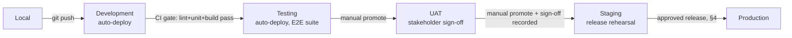
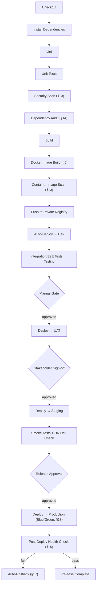
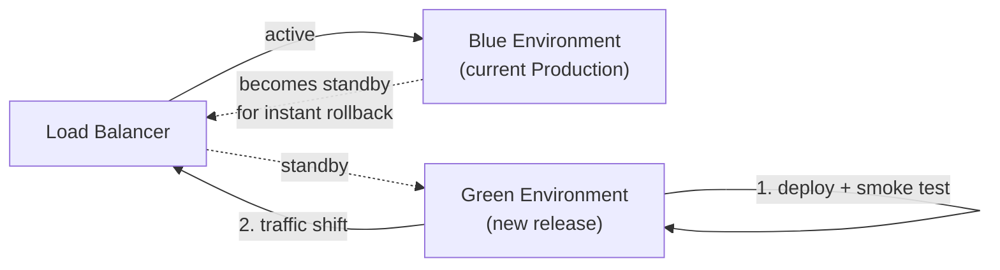

# Infrastructure & DevOps Architecture

## AI Powered Enterprise Citizen Service & Grievance Management Platform

| | |
|---|---|
| **Document Status** | DRAFT — Pending Client Approval |
| **Version** | 1.0 |
| **Date** | 2026-07-19 |
| **Based On** | `docs/SRS.md` v0.2 (Approved); `docs/ARCHITECTURE.md` v1.0 (Approved) |
| **Pilot Deployment** | Tambaram City Municipal Corporation, Tamil Nadu, India |

> **Scope**: This document designs the *operational* layer — how the already-approved System Architecture is built, deployed, run, and recovered. It does **not** change any service boundary, data flow, or component from `ARCHITECTURE.md`. Every recommendation here is explicitly reconciled against that document's Phase-1 constraint (2 VMs, NGINX + PM2, no containers in Production yet — ADR-001) and its stated future path (Docker → Kubernetes, ADR-001/ADR-009). Database design remains excluded, per instruction.

---

## 1. Environment Architecture

Six environments, each with a distinct purpose and distinct data sensitivity. This refines — does not contradict — the three-environment Recommended Default in `ARCHITECTURE.md`'s originating SRS §11.3; it is the same ladder made explicit enough for a government release-control process.

| Environment | Purpose | Data | Infra Footprint | Persistent? |
|---|---|---|---|---|
| **Local** | Individual developer machine | Synthetic/fake data only, no real PII ever | Docker Compose simulating core-api, ai-service (Claude calls mocked/stubbed), Redis, MySQL | No — disposable per developer |
| **Development (Dev)** | Shared integration point for merged work | Synthetic data, seeded fixtures | Single small VM/containers, auto-deployed on every merge to `main` | Yes, but freely resettable |
| **Testing (QA)** | Automated test execution (unit/integration/E2E) | Seeded test data, reset before each run | CI-triggered, ephemeral per pipeline run where possible | Ephemeral |
| **UAT** | Government stakeholder acceptance sign-off | Realistic **synthetic/anonymized** data shaped like production — never real citizen PII | Production-like configuration, scaled down | Yes, refreshed per UAT cycle |
| **Staging** | Final release rehearsal, DR drills, smoke tests | Anonymized copy of production-shaped data | Mirrors Production topology exactly (same PM2 groups, same NGINX config, same Docker images once containerized) | Yes |
| **Production** | Live citizen-facing system | Real data, full retention/compliance controls apply | The approved 2-VM Phase-1 footprint (`ARCHITECTURE.md` §5) | Yes — system of record |

### Promotion Flow

No environment is skipped for a standard release. The **Hotfix path** (§4, §17) is the only sanctioned shortcut, and even it passes through Staging before Production.

---

## 2. CI/CD Pipeline

**Recommended Default tooling**: GitHub Actions or GitLab CI (either satisfies the requirements below; the pipeline design is tool-agnostic and the specific product is a client/procurement choice, consistent with `ARCHITECTURE.md` §22's note that specific products are out of scope for the design documents).

Every automated gate (B–L) blocks merge/promotion on failure. Every manual gate (M, O, R) requires a named, logged approver — this is the audit trail a government release process needs.

---

## 3. Git Branching Strategy

**Recommended Default: Trunk-Based Development with short-lived feature branches, release branches for stabilization, and feature flags (§16) for incomplete work.** This is chosen over long-lived Git Flow-style development branches because it keeps `main` always deployable to Dev (required for the promotion flow in §1) while still giving a formal, auditable stabilization point for UAT/Staging/Production releases.

| Branch Type | Lifespan | Purpose |
|---|---|---|
| `main` | Permanent | Always deployable; every merge auto-deploys to Dev (§1, §2) |
| `feature/*` | Short-lived (target: <3 days) | Individual units of work; merged to `main` via PR with required review + full CI gate; incomplete features ship dark behind a feature flag (§16), never a long-lived branch |
| `release/x.y.z` | Cut at release time, retired after Production deploy | Stabilization branch for the UAT → Staging → Production promotion; only bug-fixes cherry-picked, no new features |
| `hotfix/x.y.z` | Cut from the current Production tag | Emergency fixes; merged back into both the active `release/*` branch and `main` |
| `vX.Y.Z` tags | Permanent | Applied at the exact commit deployed to Production — the audit anchor for "what code was running when" |

---

## 4. Release Strategy

- **Versioning**: Semantic Versioning (`MAJOR.MINOR.PATCH`).
- **Cadence — Recommended Default**: a scheduled release train every **2–4 weeks** for standard features, distinct from the **expedited hotfix path** (§3, §17) for critical/security fixes, which can ship same-day through the same gates (Dev→Testing→UAT→Staging→Production) but on a compressed manual-approval timeline.
- **Release Freeze Windows — Recommended Default**: no non-critical releases during the monsoon/cyclone/festival peak-load windows identified in `ARCHITECTURE.md` §13 (Tier volume spikes) — this is when the system must be most stable, not when it should be absorbing deployment risk.
- **Change documentation**: every release requires release notes (what changed, migration notes if any, rollback plan) — this is both an operational necessity and a compliance artifact for STQC/audit readiness (SRS §9).
- **Sign-off gate**: the UAT → Staging promotion (§1) is the formal go/no-go checkpoint; the named approver and timestamp are logged, consistent with `ARCHITECTURE.md` §11.5's audit logging principle applied to the release process itself.

---

## 5. Docker Strategy

**Reconciliation with the approved System Architecture**: `ARCHITECTURE.md`'s Deployment Diagram (§5) and ADR-001 place Phase-1 Production on **bare PM2 processes directly on VM-1/VM-2 — not containerized** — with containerization as an explicitly planned *future* step. This document does not change that. What it adds:

- **Docker images are built starting now**, for every logical service (§3 of `ARCHITECTURE.md`'s service catalogue) — as the single build artifact used by **Local, Dev, Testing, UAT, and Staging**.
- **Production (Phase-1) continues to run the same codebase via bare PM2 on the VM**, exactly as approved — it does not consume the Docker image yet.
- This is not two parallel build systems: it de-risks the already-planned future Production containerization (ADR-001) by proving the exact same image through four environments long before it ever reaches Production, and it gives Dev/Testing/UAT/Staging environment parity immediately.

| Concern | Recommended Default |
|---|---|
| Base image | `node:lts-alpine` (minimal attack surface, small image size) |
| Build pattern | Multi-stage build (build stage with dev dependencies → slim runtime stage) |
| Image tagging | `<service>:<git-sha>` for every build, `<service>:<semver>` applied at release tag time |
| Registry | Private container registry (self-hosted or NIC MeghRaj-provided, per `ARCHITECTURE.md` §11.2's cloud-ready path) |
| Process manager inside container | PM2 still runs inside the container in Dev/Testing/UAT/Staging — preserving parity with Production's PM2-based process model even before Production itself is containerized |
| Image scanning | Mandatory before registry push (§13) |

**Production cutover trigger**: once the second app VM / Load Balancer (`ARCHITECTURE.md` §12.3) is approved, Production switches to consuming the same registry images already validated in Staging — a deployment-target change, not a rebuild.

---

## 6. Kubernetes Deployment Strategy

This section is **future-state design only** — Kubernetes is not part of Phase-1 (`ARCHITECTURE.md` §11.1/§11.2/ADR-001). It exists here so the eventual migration has a design to execute against rather than being designed under incident pressure.

| Concern | Design |
|---|---|
| Target platforms | NIC MeghRaj or State Data Centre Kubernetes (SRS §11.2) |
| Namespacing | One namespace per environment (`dev`, `uat`, `staging`, `prod`); tenant isolation remains a data-layer concern (tenant ID on every record, per `ARCHITECTURE.md` §11.2), not a namespace-per-tenant split — this avoids namespace sprawl as more ULBs onboard |
| Workload type per service | `Deployment` for core-api, ai-service, voice-service, notification-service (all stateless, `ARCHITECTURE.md` §13.1); `CronJob` for scheduled jobs, replacing node-cron's in-process timer (§17 of `ARCHITECTURE.md`) with Kubernetes-native scheduling + the same Redis lock (`ARCHITECTURE.md` §16) retained for safety during any overlap window |
| Redis / MySQL | Prefer a managed service (cloud-managed Redis/MySQL) over self-hosted `StatefulSet` where the target platform offers one — reduces operational burden; if unavailable on NIC MeghRaj, `StatefulSet` + Persistent Volume as the fallback |
| Autoscaling | Horizontal Pod Autoscaler on request-rate/CPU per service, directly implementing `ARCHITECTURE.md` §13.2's Tier 2/3 scaling table |
| Networking | Ingress Controller + the Load Balancer already designed in `ARCHITECTURE.md` §12.3 sits in front of the Ingress |
| Health | Liveness/readiness probes call the same `/healthz` endpoints already designed in `ARCHITECTURE.md` §15 — no new health-check contract needed |
| Config/Secrets | Kubernetes `ConfigMap` for non-sensitive env vars, Kubernetes `Secret` (or an external secrets operator, §7) for sensitive values |
| High Availability | Multiple replicas per `Deployment` + `PodDisruptionBudget`, the containerized realization of `ARCHITECTURE.md` §12's Active/Passive target (which becomes closer to Active/Active for the stateless app tier once here — see `ARCHITECTURE.md` ADR-010's stated migration path) |

---

## 7. Secrets Management

| Aspect | Phase-1 (2-VM, no dedicated secrets infra) — Recommended Default | Future State (Kubernetes) |
|---|---|---|
| Storage | Environment variables injected at deploy time from the CI/CD platform's encrypted secrets store (e.g., GitHub Actions/GitLab CI secrets), written to a restricted-permission env file on the VM (owner-only read, never world-readable, never committed) | Kubernetes `Secret`, or an external secrets manager (e.g., HashiCorp Vault) integrated via a CSI driver |
| Access | Only the deploy pipeline's service identity and the application's own runtime user can read secrets; no interactive shell access to secret values as standard practice | Namespace-scoped RBAC restricting which workloads can mount which secrets |
| Segregation | Distinct secret sets per environment — a Dev/Testing Claude API key is a separate, budget-capped sandbox key, **never** the Production key (this also bounds the blast radius of Section 5's "same image, lower environments first" approach) | Same principle, enforced by namespace |
| Rotation | Recommended: rotate database credentials, JWT signing keys, and third-party API keys every 90 days, and immediately on personnel offboarding or suspected compromise | Same cadence; rotation becomes a `Secret` update + rolling restart, no manual VM file edit |
| Logging | Secrets are never logged — enforced by the same sanitization pipeline already designed for PII in `ARCHITECTURE.md` §8.2/§15 | Same |

---

## 8. SSL Certificate Management

Builds on `ARCHITECTURE.md` §11.5's Recommended Default (`*.tn.gov.in`-pattern domain, NIC/state-issued certificate for Production, TLS 1.2+/HSTS).

| Environment | Certificate Source | Renewal |
|---|---|---|
| Local/Dev/Testing | Self-signed or a shared internal CA | Not applicable / long-lived internal cert |
| UAT/Staging | Standard CA-issued (e.g., Let's Encrypt) | **Automated** via ACME (e.g., certbot), renewed well ahead of the 90-day Let's Encrypt expiry |
| Production | NIC/state-recognized certificate issuance, per compliance posture | **Manual, coordinated renewal process** — government CAs are typically not ACME-automatable; a calendar-tracked renewal task starting 45 days before expiry, plus a monitoring alert (§11) firing at 30 and 7 days before expiry so renewal is never missed |

TLS termination happens at NGINX on VM-1 in Phase-1 (`ARCHITECTURE.md` §5), moving to the Load Balancer/Ingress once that infra exists (§6). Private keys are handled as secrets (§7) — never in source control, never logged.

---

## 9. Environment Variables Strategy

- **Naming convention**: namespaced by domain, e.g., `DB_*`, `REDIS_*`, `JWT_*`, `AI_PROVIDER_*`, `WHATSAPP_PROVIDER_*`, `SMS_PROVIDER_*` — mirroring the provider-abstraction boundaries already defined in `ARCHITECTURE.md` (§8.1, §10.2), so each provider adapter has an obviously-scoped config block.
- **Categorization**: application config, datastore connection strings, cryptographic secrets, third-party provider credentials, feature flag defaults (§16) — sensitive categories flow through §7, non-sensitive through ordinary environment configuration.
- **Per-environment isolation**: no environment ever reads another environment's values; Production values are never replicated into a lower environment (§5, §7).
- **Fail-fast validation**: every service validates its required environment variables on startup and refuses to start if any are missing — surfacing a misconfiguration at deploy time, not as a runtime failure under citizen traffic.
- **Documentation**: a checked-in `.env.example` per service lists every required key with no real values — the reference for what must be provisioned per environment.

---

## 10. Backup Automation

Operationalizes `ARCHITECTURE.md` §14's Disaster Recovery design — this section is the "how it actually runs," that one was "what must be true."

| Job | Tool (Recommended Default) | Schedule | Verification |
|---|---|---|---|
| MySQL full backup | `mysqldump` or Percona XtraBackup | Daily | Automated checksum + periodic restore-test (§14.5's quarterly DR drill is the full-scale version of this) |
| MySQL binlog shipping | MySQL native binary log streaming to secondary storage | Continuous | Lag monitored; alert if shipping falls behind the 15-minute RPO target |
| Redis persistence | AOF (continuous) + RDB snapshot | Hourly (RDB) | Snapshot integrity check on write |
| File storage sync (images/documents/voice/audit attachments) | Scheduled `rsync`/`rclone`-style sync job | Daily | File-count and checksum reconciliation between source and backup target |
| Offsite replication | Sync of the above to the offsite/object storage target flagged in `ARCHITECTURE.md` §14.3 (infra pending approval) | Daily | Transfer completion + integrity check |
| Backup failure handling | — | — | Any failed backup job fires an immediate alert (§11) — a silent backup failure is the single worst DR failure mode, since it's invisible until the moment it's needed |

Retention of the backups themselves (not the underlying data) follows a rolling operational window (e.g., 90 days) distinct from the statutory archive retention already defined in SRS §4.3 and `ARCHITECTURE.md` §19.2 — backups are for restoring recent state quickly; archival is for long-term compliance retrieval.

---

## 11. Monitoring Stack

Concrete tooling for the abstract design in `ARCHITECTURE.md` §15.

| Layer | Recommended Default Tool |
|---|---|
| Metrics collection | Prometheus-compatible exporters per service (request rate/error rate/latency, queue depth, Claude call latency/cost, Whisper processing time — exactly the metric set already listed in `ARCHITECTURE.md` §15) |
| Dashboards | Grafana |
| Alerting | Alertmanager (or the monitoring platform's native equivalent), routed to an ops-facing channel distinct from the citizen-facing Notification Service (§10 of `ARCHITECTURE.md`) |
| Process-level monitoring | PM2's built-in monitoring (Phase-1) / Kubernetes-native resource metrics (future state, §6) |
| External synthetic monitoring | An outside-the-network uptime check against public endpoints — catches the case where internal monitoring itself is down, which internal-only monitoring structurally cannot detect |
| Alert thresholds | SLA breach rate spike, queue backlog growth, error rate spike, CPU/memory/disk thresholds, Claude API failure rate, notification delivery failure rate, backup job failure (§10), SSL expiry approaching (§8) — the same list from `ARCHITECTURE.md` §15, operationalized here as configured alert rules |

---

## 12. Log Management

| Aspect | Recommended Default |
|---|---|
| Aggregation | Grafana Loki + Promtail (Phase-1: lighter-weight than a full ELK stack on a 2-VM budget); ELK is a viable Tier-2/3 upgrade if richer full-text search becomes a genuine need |
| Format | Structured JSON, with the correlation/trace ID already designed in `ARCHITECTURE.md` §15 threaded through every log line |
| Separation | **Application logs** (2-year retention, SRS §4.3) and **Audit logs** (10-year retention, immutable, SRS §4.3) are shipped through **separate pipelines** — different retention, different mutability guarantees, should never share a storage bucket or lifecycle policy |
| PII handling | Sanitized before persistence, per `ARCHITECTURE.md` §8.2/§15's Error Logging principle applied to every log line, not just error logs |
| Access control | Log viewing is RBAC-gated (`ARCHITECTURE.md` §11.2) — only Ops/Admin-tier roles, itself an auditable access |
| Retention automation | Application logs auto-purged at 2 years via the Cleanup Job already catalogued in `ARCHITECTURE.md` §17; Audit logs are never auto-purged before their 10-year mark, and even then, deletion is itself an audited event (`ARCHITECTURE.md` §19.2) |

---

## 13. Security Scanning

| Scan Type | Recommended Default Tool | Trigger | Gate |
|---|---|---|---|
| Static Analysis (SAST) | ESLint security ruleset + Semgrep | Every PR | Blocks merge on high/critical findings |
| Secrets-in-code scanning | gitleaks or truffleHog | Every commit (pre-commit + CI) | Blocks merge/push if a secret pattern is detected |
| Dependency/SCA vulnerability scan | `npm audit` / Snyk / OWASP Dependency-Check | Every PR + nightly on `main` | Blocks merge on critical/high; tracked for lower severities (§14) |
| Container image scan | Trivy (or equivalent) | Before every registry push (§5) | Blocks push on critical/high vulnerabilities |
| Dynamic/penetration testing (DAST) | Third-party or internal pentest | Before major releases + annually | Formal sign-off required before Production promotion for major releases — aligned with STQC certification readiness (SRS §9) |
| Infrastructure/config hardening check | CIS Benchmark-style checklist for Ubuntu/NGINX/MySQL/Redis config | At environment provisioning + quarterly review | Findings tracked to remediation, not necessarily a hard release blocker |

---

## 14. Dependency Management

- **Lockfile discipline**: `package-lock.json` committed and enforced (CI fails on lockfile drift) — exact, reproducible dependency versions across every environment.
- **Automated update PRs — Recommended Default**: Dependabot or Renovate opens PRs for outdated dependencies; **not auto-merged** — a human reviews, especially for anything touching auth, crypto, or the AI/voice provider SDKs.
- **Vulnerability SLA**: critical CVEs patched within **7 days**, high within **30 days**, driven by the scan in §13 — a government platform's dependency posture is itself part of its CERT-In/STQC readiness (SRS §9).
- **License compliance**: an automated license check flags any dependency under a license incompatible with the project's distribution model (e.g., copyleft licenses inappropriate for a proprietary government deployment) before it's merged.
- **Runtime version pinning**: Node.js version pinned via `.nvmrc`/`engines` field, identical across Local through Production — eliminates an entire class of "works on my machine" defects.
- **Major-version upgrade review**: a quarterly review of available major-version upgrades (framework, ORM, etc.), scheduled deliberately rather than reactively.

---

## 15. API Versioning Strategy

- **Scheme — Recommended Default**: URI-based versioning, `/api/v1/...`, at the API Gateway boundary (`ARCHITECTURE.md` §4.1/§6). Chosen over header-based versioning for its explicitness, cache-friendliness, and ease of documentation/routing at the NGINX/Gateway layer.
- **Deprecation policy**: a previous major API version remains supported for a minimum **6-month notice period** after a new version ships — necessary because `ARCHITECTURE.md` §20's future integrations (mobile app, government API consumers, IoT ingestion) will come to depend on API stability, and a government platform cannot break external consumers on short notice.
- **Internal event versioning**: the queue event envelope already defined in `ARCHITECTURE.md` §18.1 (`eventType`, `tenantId`, `correlationId`, `payload`, `timestamp`) gains a `schemaVersion` field, so internal agent-to-agent event contracts can evolve independently of — and on a faster cadence than — the public API.

---

## 16. Feature Flag Strategy

**Recommended Default**: feature flags are stored as part of the existing **Tenant & Admin Config Service** (`ARCHITECTURE.md` §3.1) and cached via the existing Redis config-caching path (`ARCHITECTURE.md` §16) — this reuses infrastructure already designed rather than introducing a third-party flag service, consistent with the reuse-over-new-infra pattern behind ADR-008 (`ARCHITECTURE.md` §21).

| Flag Type | Purpose | Example |
|---|---|---|
| **Release flags** | Ship incomplete work on `main` (§3) without exposing it | A new complaint-category UI, dark-launched |
| **Ops/kill-switch flags** | Instant, code-free mitigation during an incident | Disable Claude-based classification, fall back to manual officer categorization — directly implementing the degradation strategy already designed in `ARCHITECTURE.md` §8.3 |
| **Tenant rollout flags** | Pilot a feature in Tambaram before enabling it for future ULBs | Directly serves the multi-tenant rollout model (SRS §1.3) — a flag can be tenant-scoped exactly because config is already tenant-scoped |

**Governance**: only Corporation Admin/Super Admin roles may toggle Production flags, itself an audited action (`ARCHITECTURE.md` §11.5). Flags are not permanent — a stale-flag review is a recurring hygiene task; a flag lingering past full rollout is tracked as tech debt, not left indefinitely.

---

## 17. Rollback Strategy

| Layer | Rollback Mechanism |
|---|---|
| **Application (Phase-1, bare PM2)** | Release-directory pattern: each deploy lands in a new timestamped release folder; a symlink (e.g., `current` → `releases/2026-07-19-1230`) is what NGINX/PM2 actually serve. Rollback = re-point the symlink to the previous release and reload PM2 — near-instant, no rebuild required |
| **Application (future Kubernetes)** | `kubectl rollout undo`, reverting to the previous ReplicaSet — the containerized equivalent of the same principle |
| **Database schema** | **Forward-only migrations preferred.** A destructive schema change ships with a documented manual rollback runbook, since automatic DB rollback is unsafe once new data has been written against the new schema — this principle carries forward as a hard constraint into the upcoming Database Design phase |
| **Trigger criteria** | Automated: post-deploy health check failure (§2, §15) or error-rate spike beyond threshold within a defined post-deploy monitoring window (e.g., 15 minutes). Manual: on-call engineer discretion for anything the automated thresholds don't catch |
| **Authority** | On-call engineer can trigger immediately for a Sev-1; any rollback affecting citizen-facing behavior is logged with the Corporation Admin informed, consistent with the government-facing accountability posture of this platform |
| **Post-rollback** | A rollback always triggers a post-incident review (§19) — a rollback is a signal the release process itself needs examination, not just the code |

---

## 18. Blue/Green Deployment

**Phase-1 reality**: true Blue/Green needs duplicate standing infrastructure, which the current 2-VM budget does not include. Two stages, matching `ARCHITECTURE.md` §12's own phased HA posture:

### Phase-1 — "Release-Swap" (Blue/Green-lite, single VM)
The release-directory pattern from §17 doubles as a lightweight Blue/Green: the new release is deployed and health-checked (§15) *before* the symlink switch, so the switch itself is the only moment of cutover, and rollback is the same symlink flip in reverse. This gives near-zero-downtime deploys and instant rollback without needing a second VM.

### HA Target State — True Blue/Green (once §12's second app VM / Load Balancer exists)

Deploy to the idle (Green) environment, smoke-test it in isolation, then shift the Load Balancer's target — the old (Blue) environment stays warm as the instant-rollback target for a defined soak period before being recycled for the next release.

---

## 19. Disaster Recovery Runbook

Operational, step-by-step version of the design in `ARCHITECTURE.md` §14.4, written for the on-call engineer during an actual incident. Target: complete within the **30-minute RTO** (SRS §4.2).

1. **Detect & Declare** — an alert fires (§11); on-call confirms it is a genuine incident, not a false positive, and formally declares an incident.
2. **Assess scope** — classify: App node failure / Redis failure / MySQL failure / File storage loss / Full-site loss.
3. **Notify** — internal ops channel + the designated government point of contact, per a pre-agreed communication tree (who gets notified for which severity — defined at go-live, tracked in the Production Readiness Checklist, §20).
4. **Execute restore, per failure type**:
   - *App VM failure* → activate the Passive/Standby node (`ARCHITECTURE.md` §12.2) or, in interim Phase-1 without a standby yet, redeploy from the last known-good release (§17) onto a freshly provisioned VM.
   - *Redis failure* → Sentinel auto-promotes a replica (once §12's Sentinel topology is active); Phase-1 interim: restore from the latest AOF/RDS backup (§10).
   - *MySQL failure* → promote replica if available (§12.2), or restore from latest full backup + binlog replay to the target point-in-time (§10), meeting the 15-minute RPO.
   - *File storage loss* → restore from the offsite/local backup sync (§10).
   - *Full-site loss* → restore from offsite backups onto newly provisioned infrastructure — the scenario the offsite backup target flagged in `ARCHITECTURE.md` §14.3 exists specifically to cover.
5. **Validate data integrity** — cross-check restored state against the Audit Log (`ARCHITECTURE.md` §11.5) for continuity gaps.
6. **Cutover traffic** — DNS/Load Balancer target update, or symlink/PM2 restart in Phase-1.
7. **Monitor stabilization** — watch error rates/health checks (§11, §15) through a defined soak window before standing down.
8. **Declare resolved.**
9. **Post-incident report** — filed within **48 hours**, feeding the compliance/STQC record trail (SRS §9); includes root cause, timeline, and whether the RTO/RPO targets were actually met.
10. **Update this runbook** — every real incident is a chance to correct a step that didn't work as designed; the runbook is a living document, verified further by the quarterly DR drills already mandated in `ARCHITECTURE.md` §14.5.

---

## 20. Production Readiness Checklist

Gate checklist before first go-live, and before every subsequent major release.

| Category | Checklist Item |
|---|---|
| **Security** | MFA enforced for Corporation/Super Admin (`ARCHITECTURE.md` §8.1) · Secrets rotated and scoped per-environment (§7) · TLS certificate valid with >30 days to expiry (§8) · Latest security scans (§13) show no open critical/high findings |
| **Compliance** | Audit logging verified end-to-end (write, immutability, retention) · PII masking verified end-to-end before any Claude call (`ARCHITECTURE.md` §8.2) · Retention/archive/cleanup jobs (`ARCHITECTURE.md` §17) verified running on schedule |
| **Performance** | Load test passed for the Tier-1 target volume (5,000 complaints/day peak, `ARCHITECTURE.md` §13.2) |
| **Reliability** | Backups verified via an actual test restore, not just "the job ran" (§10) · Health checks green across all services (§11, §15) · Alerting fire-drilled — a test alert was confirmed to actually reach the ops channel |
| **Operational Readiness** | DR runbook (§19) walked through at least once as a tabletop exercise · On-call rotation defined and communicated · Rollback mechanism (§17) tested, not just documented |
| **Data** | Migration scripts reviewed (forward pointer to the upcoming Database Design phase) |
| **Documentation** | SRS, System Architecture, and this Infrastructure & DevOps document all in Approved status · API documentation published for the version being released (§15) |
| **Sign-off** | Named stakeholder/government approval recorded for the release, per the Release Strategy gate (§4) |

---

## 21. Explicitly Out of Scope for This Document

- Database design, schema, and migration mechanics (separate deliverable, next phase).
- Selection of a specific cloud/CI/CD/monitoring **product** where multiple Recommended Defaults were named — these are procurement decisions, not architecture decisions.
- Load testing scripts, actual runbook automation scripts, or any code/config/IaC.

---

## 22. Approval

This Infrastructure & DevOps Architecture (v1.0) must be reviewed and approved before proceeding to Database Design.
